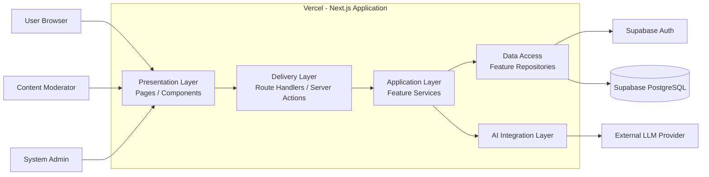
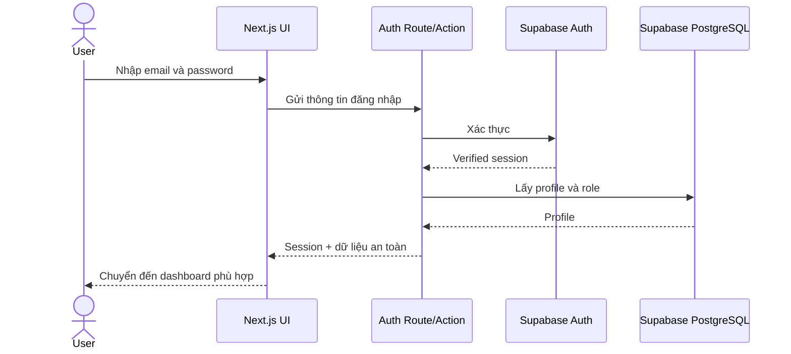
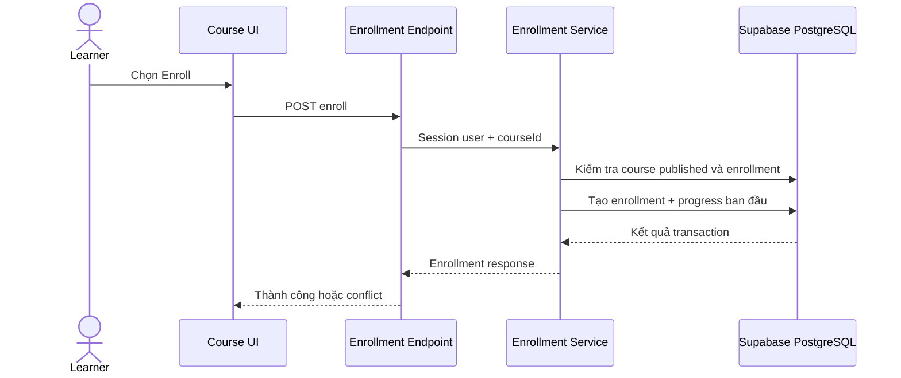
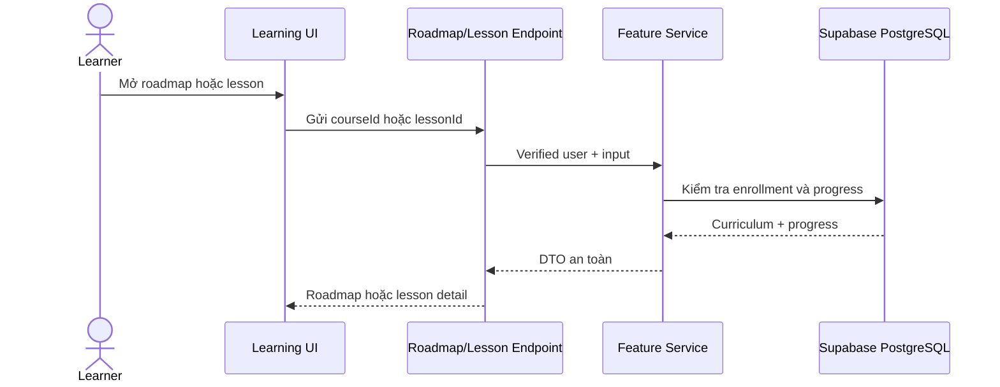
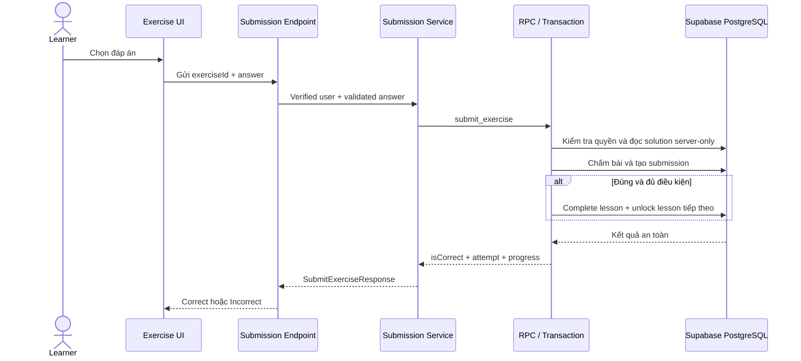
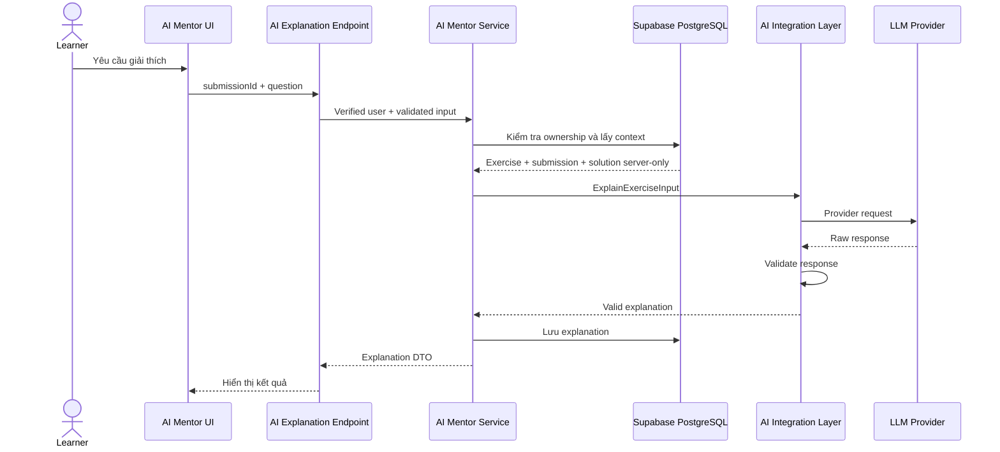
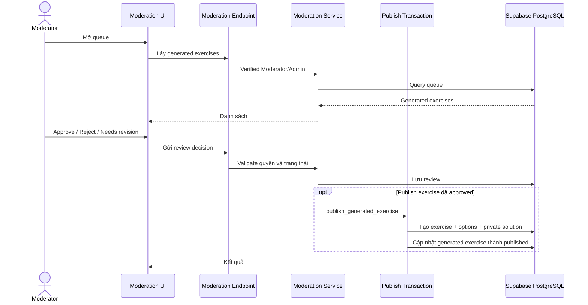

# Architecture

## 1. Mục tiêu kiến trúc

Hệ thống được thiết kế theo hướng đơn giản, dễ triển khai và phù hợp với quy mô đồ án nhỏ đến vừa.

Kiến trúc cần đáp ứng các mục tiêu:

- Hoạt động với Next.js, Supabase và Vercel.
- Tách biệt giao diện, xử lý nghiệp vụ, truy cập dữ liệu và tích hợp AI.
- Bảo vệ khóa bí mật và các chức năng có quyền hạn.
- Dễ kiểm thử, review và bảo trì.
- Cho phép mở rộng thêm khóa học, dạng bài tập hoặc AI provider mà không phải viết lại toàn bộ hệ thống.
- Giữ ranh giới module rõ ràng để nhiều AI agent không sửa chồng chéo.
- Không tạo microservice hoặc abstraction phức tạp khi chưa có nhu cầu thực tế.

Kiến trúc được chọn là:

**Client–Server kết hợp Modular Monolith**

Toàn bộ ứng dụng chính nằm trong một repository Next.js. Mã nguồn được chia theo module nghiệp vụ. Supabase cung cấp Authentication và PostgreSQL. Mọi thao tác nhạy cảm, chấm bài, cập nhật tiến độ, quản trị và lời gọi AI phải được thực hiện phía server.

---

## 2. Sơ đồ tổng quan



Luồng chính:

1. Người dùng truy cập ứng dụng Next.js được deploy trên Vercel.
2. Presentation Layer hiển thị giao diện và gửi request đến Route Handler hoặc Server Action.
3. Delivery Layer validate input cơ bản và chuyển request đến service của feature tương ứng.
4. Application Layer kiểm tra session, quyền và thực hiện nghiệp vụ.
5. Repository của feature đọc hoặc ghi dữ liệu trong Supabase.
6. Khi cần AI Mentor hoặc tạo bài tập, Application Layer gọi AI Integration Layer ở phía server.
7. Phản hồi được validate trước khi trả về giao diện hoặc lưu vào database.

Không có luồng trực tiếp:

```text
Client Component → Supabase table nhạy cảm
Client Component → LLM Provider
Client Component → cập nhật progress hoặc score
```

---

## 3. Các lớp kiến trúc

## 3.1 Presentation Layer

Presentation Layer là phần giao diện mà người dùng trực tiếp tương tác.

Công nghệ:

- Next.js.
- React.
- TypeScript.
- Tailwind CSS.

Trách nhiệm:

- Hiển thị trang đăng ký và đăng nhập.
- Hiển thị Course Catalog.
- Hiển thị Learning Roadmap.
- Hiển thị nội dung Lesson.
- Hiển thị bài tập Fix the Bug.
- Hiển thị bài tập Predict the Output.
- Hiển thị AI Mentor.
- Hiển thị hồ sơ và tiến độ học tập.
- Hiển thị giao diện Moderator và Admin theo quyền.
- Hiển thị loading, empty, success và error state.
- Gửi input của người dùng đến Delivery Layer.

Presentation Layer không được:

- Truy cập `SUPABASE_SERVICE_ROLE_KEY`.
- Chứa khóa API của LLM.
- Tự quyết định quyền Admin hoặc Moderator từ dữ liệu phía trình duyệt.
- Tự chấm bài hoặc tự tính `isCorrect` và `score`.
- Tự cập nhật progress.
- Đọc bảng `exercise_solutions`.
- Truy cập repository của feature.
- Đặt business logic chính trong page hoặc React component.

Server Component có thể gọi service phía server khi phù hợp. Client Component chỉ dùng cho tương tác cần browser state và không được chứa secret hoặc logic phân quyền cuối cùng.

---

## 3.2 Delivery Layer

Delivery Layer là điểm tiếp nhận request từ giao diện.

Có thể triển khai bằng:

- Next.js Route Handlers.
- Next.js Server Actions cho form nội bộ đơn giản.

Trách nhiệm:

1. Nhận request.
2. Parse input.
3. Validate request bằng schema đã chốt.
4. Lấy session đã xác thực.
5. Gọi service của feature.
6. Map kết quả hoặc lỗi sang response đúng `api_contract.md`.

Delivery Layer không được:

- Chứa toàn bộ business logic.
- Truy vấn Supabase trực tiếp nếu feature đã có repository.
- Tin `userId`, `role`, `isCorrect`, `score` hoặc progress status do client gửi.
- Trả raw database row.
- Tự tạo endpoint hoặc đổi field name ngoài `api_contract.md`.

Endpoint, request schema, response schema và error code được xác định trong:

```text
docs/api_contract.md
```

Nếu contract chưa có thông tin cần thiết, agent phải báo thiếu contract hoặc đề xuất cập nhật tài liệu. Không được tự phát minh endpoint hoặc field để tiện triển khai.

---

## 3.3 Application Layer

Application Layer chứa use case và quy tắc nghiệp vụ.

Application Layer được tổ chức theo feature, không dùng một thư mục `src/services/` chung ngay từ đầu.

Cấu trúc chuẩn của một feature:

```text
src/features/<feature-name>/
├── components/
├── <feature-name>.types.ts
├── <feature-name>.schema.ts
├── <feature-name>.repository.ts
├── <feature-name>.service.ts
└── <feature-name>.service.test.ts
```

Không bắt buộc mọi feature phải có đầy đủ các file nếu chưa cần.

Trách nhiệm:

- Service chứa business logic và điều phối use case.
- Repository chứa truy vấn Supabase của feature.
- Schema chứa validation.
- Types chứa kiểu dữ liệu thuộc feature.
- Components chứa UI riêng của feature.
- Unit test đặt cạnh logic được kiểm thử.

Ví dụ `progress.service.ts` chịu trách nhiệm:

- Lấy tiến độ của learner.
- Tính phần trăm hoàn thành.
- Chuyển trạng thái `locked`, `unlocked`, `inProgress`, `completed`.
- Xác định lesson tiếp theo.
- Không cho trạng thái `completed` bị hạ xuống bởi attempt sau.

Ví dụ `submission.service.ts` chịu trách nhiệm:

- Kiểm tra learner có quyền truy cập exercise.
- Validate answer theo exercise type.
- Đọc solution bằng server-side access.
- Chấm đáp án.
- Tạo submission.
- Gọi Progress Module trong cùng transaction hoặc RPC an toàn.
- Trả kết quả không chứa raw solution.

### Quy tắc gọi giữa feature

- Feature không import repository nội bộ của feature khác.
- Feature cần nghiệp vụ của module khác phải gọi public service được export.
- Không tạo dependency vòng tròn.
- Logic xuyên nhiều module phải có một service điều phối rõ ràng.
- Không chuyển code vào `shared` chỉ để né quyết định module sở hữu code.

---

## 3.4 Data Access

Repository được đặt trong feature sở hữu dữ liệu và hành vi liên quan.

Ví dụ:

```text
src/features/exercises/exercise.repository.ts
src/features/submissions/submission.repository.ts
src/features/progress/progress.repository.ts
```

Repository chỉ chịu trách nhiệm:

- Tạo query.
- Map database row sang kiểu dữ liệu nội bộ.
- Insert, update hoặc delete theo yêu cầu của service.
- Trả lỗi hạ tầng để service xử lý.

Repository không được:

- Chứa React code.
- Chứa quyết định nghiệp vụ phức tạp.
- Tự bỏ qua RLS hoặc authorization.
- Dùng `select("*")` khi không cần tất cả cột.
- Trả raw Supabase row trực tiếp cho client.

Kết nối Supabase dùng chung nằm trong:

```text
src/lib/supabase/
```

---

## 3.5 Authentication và Authorization

Supabase Auth chịu trách nhiệm:

- Đăng ký.
- Đăng nhập.
- Đăng xuất.
- Quản lý session.
- Khôi phục hoặc đặt lại mật khẩu.

Hệ thống sử dụng các role:

- Learner.
- Moderator.
- Admin.

Guest là trạng thái chưa đăng nhập và không được lưu thành role trong database.

Role của ứng dụng được lưu tại:

```text
profiles.role
```

Không lấy role từ metadata do client tự gửi khi đăng ký.

Phân quyền được thực hiện ở nhiều lớp:

### Session check

Server lấy user ID từ session đã xác thực. Không tin user ID do client gửi.

### Role check

Server kiểm tra role trước khi chạy use case Moderator hoặc Admin.

### Ownership check

Server kiểm tra tài nguyên có thuộc learner hiện tại hay không, ví dụ submission và AI explanation.

### Row Level Security

Mọi bảng trong schema `public` phải bật RLS theo `database.md` và `security.md`.

RLS là lớp bảo vệ cuối cùng, nhưng không thay thế validation, role check hoặc business rule.

Ví dụ:

- Learner chỉ xem profile và dữ liệu học tập của chính mình.
- Learner không đọc `exercise_solutions`.
- Learner không tự cập nhật role, score hoặc progress.
- Moderator chỉ thực hiện các chức năng kiểm duyệt được cho phép.
- Admin vẫn không được xem password, token hoặc secret.

---

## 3.6 Data Layer

Supabase PostgreSQL được sử dụng làm Data Layer.

Các bảng chính của MVP:

```text
profiles
courses
course_enrollments
chapters
lessons
exercises
exercise_options
exercise_solutions
user_progress
submissions
ai_explanations
generated_exercises
exercise_reviews
```

`admin_logs` là phần mở rộng sau MVP nếu được triển khai theo `database.md` và ADR tương ứng.

Quan hệ chính:

```text
Auth User
  └── Profile
        ├── Course Enrollment
        ├── User Progress
        ├── Submission
        └── Generated Exercise / Review theo quyền

Course
  └── Chapter
        └── Lesson
              └── Exercise
                    ├── Exercise Option
                    └── Exercise Solution (server-only)

Submission
  └── AI Explanation

Generated Exercise
  └── Exercise Review
```

Nguyên tắc:

- Supabase Auth quản lý danh tính, email, password và session.
- `profiles` lưu username, role và trạng thái ứng dụng.
- Không lưu password trong bảng ứng dụng.
- Database dùng thuật ngữ `lesson`; UI có thể hiển thị “Step”, nhưng không tạo bảng `steps` trong MVP.
- Correct solution nằm trong `exercise_solutions`, không nằm trong public exercise response.
- Mọi bảng public phải bật RLS.
- Thay đổi schema chỉ được thực hiện bằng SQL migration.
- Không sửa production database thủ công mà không có migration.
- Sau migration phải generate lại Supabase TypeScript types vào `src/generated/database.types.ts`.

Database schema, enum, constraint, index, policy và migration order phải tuân theo:

```text
docs/database.md
```

---

## 3.7 AI Integration Layer

AI Integration Layer là lớp trung gian giữa Application Layer và nhà cung cấp LLM.

Mục tiêu:

- Không để trình duyệt gọi trực tiếp LLM.
- Không để lộ API key.
- Không làm feature phụ thuộc chặt vào SDK của OpenAI, Gemini hoặc provider cụ thể.
- Có thể mock provider trong test.
- Có thể thay provider mà không đổi API của feature.

Cấu trúc:

```text
src/lib/ai/
├── ai-provider.interface.ts
├── prompt-builder.ts
├── response-validator.ts
├── ai.types.ts
└── providers/
    └── <provider-name>.provider.ts
```

Trong MVP chỉ triển khai một provider thật.

Interface tối thiểu:

```ts
interface AIProvider {
  explainExercise(input: ExplainExerciseInput): Promise<AIExplanation>;
  generateExercise(input: GenerateExerciseInput): Promise<GeneratedExercise>;
}
```

### Prompt Builder

Prompt chỉ chứa ngữ cảnh cần thiết:

- Lesson content liên quan.
- Exercise content.
- Submission của learner.
- Câu hỏi của learner.
- Correct solution khi cần và chỉ ở phía server.
- Loại bài tập.

Không gửi secret, token hoặc dữ liệu của learner khác.

### Provider Adapter

Provider Adapter chuyển request chung của hệ thống thành request của nhà cung cấp LLM.

### Response Validator

Mọi phản hồi AI phải được validate trước khi hiển thị hoặc lưu.

AI response:

- Không được thực thi như code.
- Không được tự cập nhật progress.
- Không được tự thay đổi correct solution.
- Không được tự động publish generated exercise.

Khi AI tạo bài tập:

1. Server gửi yêu cầu đến provider.
2. Response được validate.
3. Generated exercise được lưu với trạng thái `pending`.
4. Moderator review.
5. Bài tập có thể chuyển thành `approved`, `rejected` hoặc `needsRevision`.
6. Chỉ generated exercise đã `approved` mới được publish qua transaction hoặc RPC an toàn.

---

## 4. Các module nghiệp vụ

## 4.1 Auth Module

Trách nhiệm:

- Đăng ký.
- Đăng nhập.
- Đăng xuất.
- Lấy session hiện tại.
- Lấy profile và role.
- Kiểm tra tài khoản active.

Không chịu trách nhiệm:

- Quản lý course.
- Chấm bài.
- Cập nhật progress.

---

## 4.2 Course Module

Trách nhiệm:

- Lấy danh sách course đã publish.
- Tìm kiếm course.
- Lấy course detail.
- Quản lý dữ liệu course theo quyền phù hợp.

Course Module không quản lý enrollment hoặc progress cá nhân.

---

## 4.3 Enrollment Module

Trách nhiệm:

- Enroll learner vào course.
- Ngăn enrollment trùng.
- Tạo trạng thái học ban đầu.
- Mở lesson đầu tiên theo rule MVP.
- Theo dõi trạng thái enrollment.

Enrollment phải chạy qua server-side service hoặc transaction an toàn.

---

## 4.4 Roadmap Module

Trách nhiệm:

- Trả cấu trúc Course → Chapter → Lesson.
- Kết hợp cấu trúc nội dung với progress của learner hiện tại.
- Tính phần trăm hoàn thành.
- Xác định lesson gần nhất hoặc lesson tiếp theo.

Roadmap không trả full lesson content hoặc exercise solution.

---

## 4.5 Lesson Module

Trách nhiệm:

- Lấy lesson detail.
- Kiểm tra lesson không bị locked.
- Chuyển `unlocked` thành `inProgress` khi learner bắt đầu.
- Trả danh sách exercise summary.

Database dùng entity `lesson`. “Step” chỉ là nhãn hiển thị nếu UI cần.

---

## 4.6 Exercise Module

Trách nhiệm:

- Lấy exercise learner được phép truy cập.
- Trả cấu trúc phù hợp với từng exercise type.
- Không trả solution hoặc cờ option đúng.
- Cung cấp evaluator cho service chấm bài.

Exercise type trong MVP:

- `predictOutput`.
- `fixTheBug`.

MVP của Fix the Bug ưu tiên chọn syntax đúng từ danh sách. Drag-and-drop là cải tiến P1 và không được làm thay đổi contract chấm bài nếu không cần thiết.

---

## 4.7 Submission Module

Trách nhiệm:

- Validate answer theo exercise type.
- Chấm đáp án phía server.
- Tính attempt number.
- Tạo một submission cho mỗi lần nộp.
- Trả Correct hoặc Incorrect.
- Gọi Progress Module khi đáp án đúng.

Client không được gửi:

- `userId`.
- `isCorrect`.
- `score`.
- `attemptNumber`.
- Progress status.

Submission, completion và unlock phải được xử lý nguyên tử bằng RPC hoặc transaction service theo `database.md`.

---

## 4.8 Progress Module

Trách nhiệm:

- Lấy trạng thái học của lesson.
- Quản lý các trạng thái:
  - `locked`.
  - `unlocked`.
  - `inProgress`.
  - `completed`.
- Tính phần trăm hoàn thành.
- Hoàn thành lesson khi learner đã đúng tất cả exercise bắt buộc.
- Mở khóa lesson tiếp theo theo `chapter_order` và `lesson_order`.
- Hoàn thành course khi tất cả lesson đã publish đều completed.

Không dùng ID để suy ra thứ tự lesson.

Progress completed không bị hạ trạng thái khi learner làm lại và trả lời sai.

---

## 4.9 AI Mentor Module

Trách nhiệm:

- Nhận yêu cầu giải thích dựa trên submission của learner.
- Kiểm tra submission ownership.
- Thu thập context phía server.
- Gọi AI Integration Layer.
- Validate response.
- Lưu lịch sử giải thích theo contract.

AI Mentor không trực tiếp thay đổi đáp án đúng hoặc tiến độ học tập.

---

## 4.10 Moderation Module

Trách nhiệm:

- Lấy generated exercise queue.
- Cho phép Moderator xem và chỉnh sửa nội dung được phép.
- Approve, reject hoặc yêu cầu revision.
- Lưu review history.
- Publish generated exercise đã approved thông qua transaction an toàn khi actor có quyền.

Learner không được truy cập module này.

---

## 4.11 Admin Module

Trách nhiệm:

- Tìm kiếm tài khoản.
- Xem thông tin cần thiết của tài khoản.
- Thay đổi role.
- Vô hiệu hóa tài khoản.
- Theo dõi trạng thái hệ thống ở mức được phép.
- Gọi các service nghiệp vụ bằng quyền Admin khi contract cho phép.

Admin Module không chứa bản sao business logic của các module khác.

---

## 5. Luồng xử lý chính

## 5.1 Đăng nhập



UI không truy vấn trực tiếp bảng profile để tự quyết định quyền cuối cùng.

---

## 5.2 Enroll course



---

## 5.3 Xem roadmap và lesson



Lesson locked phải bị từ chối ở server, không chỉ vô hiệu hóa nút trên UI.

---

## 5.4 Nộp bài và cập nhật tiến độ



Không triển khai completion và unlock bằng nhiều thao tác client rời rạc.

---

## 5.5 Yêu cầu AI giải thích



---

## 5.6 Moderator duyệt và publish bài tập AI



---

## 6. Cấu trúc thư mục chính thức

```text
project/
├── AGENTS.md
├── CODEX.md
├── GEMINI.md
├── README.md
├── ROADMAP.md
├── CHANGELOG.md
├── TASKS.md
├── package.json
├── package-lock.json
├── .env.example
├── .gitignore
│
├── docs/
│   ├── requirements.md
│   ├── architecture.md
│   ├── tech_stack.md
│   ├── coding_standards.md
│   ├── database.md
│   ├── deployment.md
│   ├── api_contract.md
│   ├── non_requirements.md
│   ├── security.md
│   ├── testing.md
│   ├── ui.md
│   ├── features.md
│   ├── decisions.md
│   ├── monitoring.md
│   └── diagrams/
│
├── supabase/
│   ├── config.toml
│   ├── seed.sql
│   ├── migrations/
│   ├── functions/
│   └── policies/
│
├── src/
│   ├── app/
│   │   ├── (public)/
│   │   ├── (learner)/
│   │   ├── moderator/
│   │   ├── admin/
│   │   └── api/
│   │
│   ├── components/
│   │   └── ui/
│   │
│   ├── features/
│   │   ├── auth/
│   │   ├── courses/
│   │   ├── enrollments/
│   │   ├── roadmap/
│   │   ├── lessons/
│   │   ├── exercises/
│   │   ├── submissions/
│   │   ├── progress/
│   │   ├── ai-mentor/
│   │   ├── moderation/
│   │   └── admin/
│   │
│   ├── lib/
│   │   ├── supabase/
│   │   ├── ai/
│   │   ├── auth/
│   │   ├── errors/
│   │   └── permissions/
│   │
│   ├── shared/
│   │   ├── constants/
│   │   ├── types/
│   │   └── validation/
│   │
│   ├── generated/
│   │   └── database.types.ts
│   │
│   └── middleware.ts
│
├── tests/
│   ├── integration/
│   ├── e2e/
│   ├── fixtures/
│   ├── helpers/
│   └── setup/
│
├── scripts/
├── .github/workflows/
├── playwright.config.ts
├── vitest.config.ts
├── eslint.config.js
├── prettier.config.js
└── tsconfig.json
```

Quy tắc tổ chức:

- `app/` chứa route, page, layout, loading, error, Route Handler và Server Action.
- `components/ui/` chỉ chứa component dùng chung không có business logic.
- `features/` chứa code theo module nghiệp vụ, gồm service và repository của chính feature.
- `lib/` chứa infrastructure và helper dùng chung.
- `shared/` chỉ chứa constant, type và validation thực sự dùng bởi nhiều feature.
- `generated/` chứa code được generate, không chỉnh sửa thủ công.
- Unit test đặt cạnh source.
- Integration test đặt trong `tests/integration`.
- End-to-End test đặt trong `tests/e2e`.
- Không tạo `src/services/` chung.
- Không tạo `tests/unit/` song song với unit test đặt cạnh source.

---

## 7. Quy tắc dependency

Dependency được phép:

```text
app / UI
  → feature public service hoặc Route Handler
  → feature service
  → feature repository
  → Supabase

feature service
  → public service của feature khác khi cần
  → lib infrastructure
  → shared types/constants
```

Dependency không được phép:

```text
Client Component → repository
Feature A → repository nội bộ của Feature B
Repository → React component
lib → feature business logic
shared → feature cụ thể
```

Nếu hai module cần import lẫn nhau, thiết kế phải được xem lại thay vì dùng import vòng tròn.

---

## 8. Xử lý lỗi

API phải trả response theo `api_contract.md`.

Nhóm lỗi chính:

- Validation error.
- Unauthenticated.
- Forbidden.
- Not found.
- Conflict.
- Lesson locked.
- Rate limited.
- Database error.
- AI provider error.
- AI response invalid.
- Internal error.

Nguyên tắc:

- Không trả stack trace cho client.
- Không trả raw database error.
- Không để lộ secret, table nội bộ hoặc policy detail.
- Error message phía client phải an toàn và đủ để người dùng hiểu.
- Log phía server có request ID khi phù hợp.
- AI lỗi không được làm hỏng luồng học cơ bản.

---

## 9. Bảo mật kiến trúc

Các nguyên tắc bắt buộc:

- Dùng Supabase Auth, không tự lưu password.
- Bật RLS cho mọi bảng public.
- Kiểm tra session và role phía server.
- Kiểm tra ownership đối với dữ liệu riêng tư.
- Không tin user ID, role, score hoặc trạng thái do client gửi.
- Không đưa service role key hoặc AI API key vào biến `NEXT_PUBLIC_*`.
- Không đọc `exercise_solutions` từ client.
- Không gọi AI từ browser.
- Validate mọi input tại server boundary.
- Rate limit endpoint đăng nhập và AI khi cần.
- Không cho client gửi system prompt.
- Không render AI response bằng `dangerouslySetInnerHTML` khi chưa sanitize.
- Ghi audit log cho thao tác nhạy cảm khi chức năng audit được triển khai.

Security chi tiết phải tuân theo:

```text
docs/security.md
```

---

## 10. Kiểm thử kiến trúc

Công cụ:

- Vitest cho unit test và integration test.
- Playwright cho End-to-End test.
- Supabase local hoặc test project cho database và RLS test.
- Mock AI provider trong test mặc định.

### Unit test

Đặt cạnh source, ưu tiên:

- Exercise evaluator.
- Progress calculation.
- Permission helper.
- Validation schema.
- Prompt builder.
- AI response validator.
- Mapper và error mapping.

### Integration test

Đặt trong `tests/integration`, ưu tiên:

- Authentication integration.
- Enrollment tạo progress ban đầu.
- Submission và progress transaction.
- RLS chặn user khác.
- Moderator review và publish.
- Admin authorization.

### End-to-End test

Đặt trong `tests/e2e`, kiểm tra critical flow:

- Guest đăng ký.
- Learner đăng nhập.
- Learner enroll course.
- Learner xem roadmap.
- Learner mở lesson.
- Learner làm bài và nhận feedback.
- Progress được cập nhật và lesson tiếp theo được unlock.
- Learner yêu cầu AI giải thích.
- Moderator review.
- Admin route được bảo vệ.
- Người sai quyền bị từ chối.

Testing phải đi cùng feature. Không đợi đến cuối dự án mới viết test.

---

## 11. Deployment Architecture

Môi trường:

- Local: Next.js local và Supabase local hoặc development project.
- Preview: Vercel Preview kết nối development/staging Supabase.
- Production: branch `main`, Vercel Production và Supabase Production.

Git flow cho nhóm nhỏ:

```text
feature/<task-id>-<feature-name>
        ↓
Pull Request vào main
        ↓
Review + Lint + Type Check + Test + Build
        ↓
Merge main
        ↓
Vercel Production Deploy
```

Không dùng production database cho development, preview hoặc test.

Database migration phải được review và chạy theo quy trình trong `deployment.md`.

---

## 12. Khả năng mở rộng

### Thêm khóa học

Thêm dữ liệu Course, Chapter, Lesson và Exercise. Không cần đổi kiến trúc.

### Thêm dạng bài tập

Cần:

- Type và schema mới.
- UI component mới.
- Evaluator mới.
- Contract và migration nếu dữ liệu thay đổi.

Không sửa evaluator cũ nếu không cần.

### Thay AI provider

Tạo adapter mới triển khai `AIProvider`.

Feature service tiếp tục gọi interface chung.

### Tăng tải

Ưu tiên theo thứ tự:

1. Tối ưu query và index.
2. Pagination.
3. Cache dữ liệu public phù hợp.
4. Giới hạn và theo dõi AI request.
5. Background job nếu thật sự cần.
6. Chỉ tách service khi module cần scale hoặc deploy độc lập.

Phiên bản đầu không dùng microservice.

---

## 13. Quy tắc dành cho AI Agent

Khi AI agent tạo hoặc sửa code liên quan kiến trúc:

1. Đọc task packet và các tài liệu được chỉ định trong `AGENTS.md`.
2. Chỉ triển khai ADR có trạng thái `Accepted`.
3. Không tự đổi framework, database, hosting hoặc package manager.
4. Không tạo `src/services/` chung.
5. Không tạo backend repository riêng.
6. Không cho Client Component truy cập repository hoặc dữ liệu nhạy cảm.
7. Không import repository của feature khác.
8. Không tạo table, enum, endpoint, field hoặc role ngoài tài liệu đã chốt.
9. Không gọi AI từ browser.
10. Không cho client tự chấm bài hoặc cập nhật progress.
11. Chỉ sửa file nằm trong `Files allowed to change` của task.
12. Viết hoặc cập nhật test cùng thay đổi.
13. Chạy lint, type check, test và build nếu môi trường cho phép.
14. Báo rõ file đã thay đổi, command đã chạy và lỗi còn lại.
15. Nếu task mâu thuẫn kiến trúc hoặc ADR, chuyển task thành `BLOCKED` và đề xuất ADR thay vì tự chọn hướng.

Vai trò trong workflow vibe coding:

```text
Antigravity / Gemini
  → Planner, Reviewer, Tester

Codex
  → Implementer, Test Writer, Fixer
```

Reviewer ghi finding và acceptance result. Reviewer không tự mở rộng scope hoặc âm thầm sửa kiến trúc để làm test pass.

---

## 14. Quyết định kiến trúc chính

| Vấn đề | Quyết định |
|---|---|
| Kiểu kiến trúc | Client–Server + Modular Monolith |
| Tổ chức source | Feature-based modules |
| Frontend | Next.js + TypeScript |
| Server boundary | Route Handlers và Server Actions |
| Business logic | Service nằm trong feature |
| Data access | Repository nằm trong feature |
| UI | Tailwind CSS |
| Authentication | Supabase Auth |
| Database | Supabase PostgreSQL |
| Phân quyền dữ liệu | Server checks + Supabase RLS |
| Correct solution | `exercise_solutions` server-only |
| Progress update | Server-side transaction hoặc RPC |
| AI | Server-side AI Integration Layer |
| Unit/Integration test | Vitest |
| End-to-End test | Playwright |
| Deploy | Vercel |
| Repository | Một GitHub repository |
| Git flow | Feature branch → PR → main |
| Package manager | npm khi có `package-lock.json` |
| Microservices | Không dùng trong MVP |
| Code execution sandbox | Không thuộc MVP |

---

## 15. Kết luận

Kiến trúc ưu tiên khả năng hoàn thành, kiểm thử và vận hành sản phẩm trước.

Ứng dụng được giữ trong một Next.js repository để giảm độ phức tạp. Mã nguồn được chia theo các feature Auth, Course, Enrollment, Roadmap, Lesson, Exercise, Submission, Progress, AI Mentor, Moderation và Admin.

Service và repository nằm trong feature sở hữu nghiệp vụ. Supabase đảm nhiệm Authentication và PostgreSQL. Vercel chạy ứng dụng Next.js. Mọi thao tác nhạy cảm, chấm bài, cập nhật tiến độ, quản trị và lời gọi AI được thực hiện phía server.

Cấu trúc này đủ rõ để Antigravity và Codex làm việc trên cùng workspace mà không tự suy đoán ranh giới module, đồng thời vẫn cho phép mở rộng thêm khóa học, exercise type hoặc AI provider trong tương lai.
