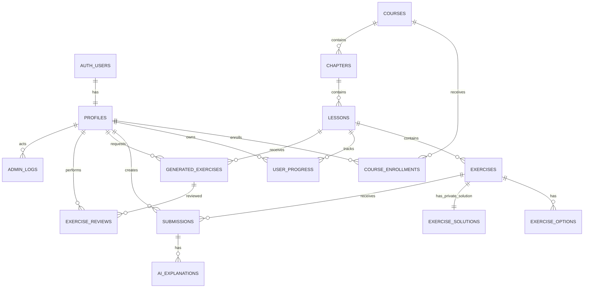

# Database

## Topic Course multi-source compatibility — migration 030

`030_topic_course_multi_source.sql` is additive and preserves all historical draft, citation,
publication, Course, Chapter, Lesson, learner, progress, and Exercise rows. It adds the compatible
source initialization flag, nullable immutable initialization identity, Admin-only provenance
metadata, and an exclusive ordered one-to-eight-source ownership bridge.

Backfill creates exactly one file metadata row per existing source and one order-zero bridge row
per legacy job. Every job anchor must equal its order-zero bridge. Staged/failed/zero-chunk sources
remain unattached. Initialization, attach/detach, job-wide outline/citation persistence, and
publication are active-Admin `SECURITY DEFINER` RPCs with empty `search_path`; `PUBLIC`/`anon`
execution is revoked. Publication still performs official curriculum writes and all-source
archival atomically and returns the prior publication on retry.

Before rollout, apply migrations 001 through 030 to a clean production-like database, compare
protected row content/counts before and after 030, run invariant/ACL/RLS checks, and regenerate
types. Migration history must never be rewritten or down-migrated destructively.

## TASK-056 Course archival

- `courses.archived_at timestamptz null` distinguishes manageable courses from courses
  removed from the product. `courses_archived_not_published` prevents any legacy publish
  path from making an archived Course public again.
- `admin_archive_course(bigint)` is an authenticated-only, `SECURITY DEFINER`, empty
  `search_path` RPC. It verifies `auth.uid()` is an active Admin, locks the Course,
  unpublishes the Course and all descendant curriculum, stamps `archived_at`, and writes
  `course.archived` to `admin_logs` in one transaction.
- The RPC never deletes enrollments, progress, submissions, exercises, source documents,
  or drafts. Referential history is preserved.

## AI Course import persistence — implemented by TASK-057

Migration `025_pdf_to_course_pipeline.sql` implements the normalized two-stage model below.
Migration `023` remains compatibility-only: it creates official unpublished curriculum
before review and therefore is not used by the Admin default PDF-to-Course flow.

### Normalized draft model

Migration `025` creates:

```text
source_documents
  └── course_import_jobs
        └── course_drafts
              ├── course_draft_objectives
              └── course_outline_lessons (ordered)
                    ├── course_outline_lesson_objectives
                    ├── course_outline_lesson_sources
                    └── lesson_content_drafts
                          └── lesson_content_draft_citations
```

- `course_import_jobs` là state-machine/audit identity của một lần import và tham chiếu
  đúng một `source_document_id`.
- `course_drafts` giữ metadata/revision của Course draft; chưa phải `courses`.
- `course_outline_lessons` giữ Lesson identity/order/title/summary/source references để
  add/remove/reorder độc lập trước khi sinh content.
- `lesson_content_drafts` giữ content/revision/provider state riêng cho từng outline
  Lesson; một revision `status = 'ready'` là checkpoint hoàn tất authoritative cho Lesson đó,
  và job-level failure không xóa hoặc invalidate checkpoint này. Regenerate một Lesson không ghi
  đè Lesson khác.
- Objective, Lesson order và source relation cần edit/query độc lập phải là row/column có
  constraint; không nhét toàn bộ Course outline vào một JSON blob.

### State and invariants

```text
uploaded → processing → outline_review → generating_content
         → content_review → ready_to_publish → published
         ↘ failed
outline_review|content_review → rejected
any unresolved queue state → hard-deleted with its exclusively owned import sources (explicit Admin removal)
```

- Transition phải compare-and-set hoặc lock job row để retry/concurrent request không
  tạo duplicate Course/Lesson.
- Chỉ một approved outline revision được dùng để generate Lesson content.
- `ready_to_publish` yêu cầu mọi outline Lesson còn hiệu lực có valid content draft.
- Pipeline A không có FK, trigger hoặc RPC insert vào `generated_exercises`, `exercises`,
  `exercise_options` hoặc `exercise_solutions`.

### Atomic publish

Một RPC/transaction `publish_course_import_job` (hoặc tên tương đương được chốt trong
migration) phải lock job ở `ready_to_publish`, tạo official Course/Chapter/Lessons từ
approved draft, ghi publication/audit mapping và chuyển job sang `published` trong cùng
transaction. Bất kỳ lỗi insert Lesson/audit/mapping nào phải rollback toàn bộ; retry sau
success trả cùng published identity thay vì tạo bản sao.

Reject chỉ chuyển job/draft sang `rejected`; không tạo hoặc xóa official curriculum.
Pending query chỉ lấy `outline_review|content_review|ready_to_publish` (và revision state
có thể hành động), nên resolved item biến mất bền vững sau reload.

Migration `034_remove_course_import_from_queue.sql` adds the active-Admin-only
`remove_course_import_from_queue(bigint)` RPC. It locks the job, refuses `published` and already
`rejected` states, captures the exclusively owned private storage identities, then deletes the job
and owned source-document rows transactionally. Cascades remove that import's drafts, chunks,
citations, and reviews; an immutable `course_import.removed_from_queue` audit record retains the job
identity, prior state, and deleted source IDs. The service removes the captured private storage
objects after commit. Official Course, Chapter, Lesson, publication, learner, progress, and Exercise
rows are not deleted.

### Exercise ownership remains separate

Không thêm `course_id` vào bảng bài tập. `generated_exercises.lesson_id` và
`exercises.lesson_id` vẫn là ownership duy nhất của bài tập. Exercise generation/review
không được thay đổi `course_import_jobs` hoặc Course draft state.

## TASK-050 — Separated content destination RPCs

`create_content_curriculum(p_course_title text, p_course_slug text,
p_chapter_title text)` creates one unpublished course, first chapter, and initial
lesson in a single active-Admin-authorized transaction. The chapter and lesson use
the server-derived source filename. The server owns slug generation; `PUBLIC` and
`anon` have no execute permission.

`create_content_target_in_course(p_course_id bigint, p_chapter_title text)` locks an
existing course, appends an unpublished chapter at the next order, and creates its
initial unpublished lesson atomically. It uses the same active-Admin check, empty
search path, execute restrictions, and audit boundary. Existing curriculum rows are
not modified.

## TASK-046 — New lesson content target RPC

`create_lesson_content_target(p_chapter_id bigint, p_title text)` is an
`authenticated`-only security-definer RPC with an empty search path. It verifies an
active Admin, locks the selected chapter to serialize order allocation, inserts an
unpublished lesson at `max(lesson_order) + 1`, and records
`lesson_content_target.created` in `admin_logs`. `PUBLIC` and `anon` have no execute
permission.

## 1. Mục tiêu

Tài liệu này là **nguồn chuẩn duy nhất** để AI agent tạo migration, Supabase types, repository và service liên quan đến database.

Database sử dụng:

- Supabase PostgreSQL.
- Supabase Auth.
- Row Level Security (RLS).
- SQL migration trong thư mục `supabase/migrations/`.

Thiết kế ưu tiên:

- Đủ đơn giản để hoàn thành MVP.
- Không để lộ đáp án đúng hoặc khóa bí mật cho client.
- Hỗ trợ Learner, Moderator và Admin.
- Hỗ trợ Course → Chapter → Lesson → Exercise.
- Lưu tiến độ, lần nộp bài và lời giải thích AI.
- Kiểm duyệt bài tập do AI tạo trước khi xuất bản.
- Có thể mở rộng thêm khóa học, dạng bài tập và RAG sau này.

---

## 1.1 Phạm vi theo milestone

### Core Learning MVP

Các bảng bắt buộc:

```text
profiles
courses
course_enrollments
chapters
lessons
exercises
exercise_options
exercise_solutions
user_progress
submissions
ai_explanations
```

### P1 / Operations Extension

Các bảng chỉ triển khai khi task tương ứng được duyệt:

```text
generated_exercises
exercise_reviews
admin_logs
course_import_jobs
course_drafts
course_draft_objectives
course_outline_lessons
course_outline_lesson_objectives
course_outline_lesson_sources
lesson_content_drafts
lesson_content_draft_citations
```

AI generation, moderation và Admin mutation không được bật trước migration, RLS, transaction và test của nhóm bảng P1.

---

## 2. Kết luận review thiết kế cũ

Thiết kế PA2 có nền tảng đúng, nhưng cần chỉnh một số điểm khi triển khai với Supabase:

1. Không tạo bảng `users` riêng chứa password. Supabase Auth quản lý email, password và session.
2. Thêm bảng `profiles` liên kết một-một với `auth.users`.
3. Thêm bảng `course_enrollments` để biết learner đang học khóa nào và tránh phụ thuộc vào giả định chỉ có một khóa học.
4. Không lưu `correct_answer` trong bảng `exercises` mà client có thể đọc. Đáp án đúng được tách sang bảng riêng `exercise_solutions`, chỉ server được truy cập.
5. `exercise_options` chỉ chứa lựa chọn hiển thị, không chứa cờ `is_correct`.
6. Bổ sung unique constraint, check constraint, foreign-key action và index rõ ràng.
7. Chuẩn hóa trạng thái bài học thành `locked`, `unlocked`, `in_progress`, `completed`.
8. `ai_explanations.response` phải cho phép `NULL` khi lời gọi AI thất bại.
9. Mọi thay đổi tiến độ, chấm bài và xuất bản bài tập AI phải đi qua server-side service hoặc database function an toàn.

Schema bên dưới là schema được chốt để AI code.

---

## 3. Nguyên tắc bắt buộc

- Tên bảng và cột dùng `snake_case`.
- User ID dùng `uuid` và tham chiếu `auth.users(id)`.
- Các ID nội dung dùng `bigint generated always as identity`.
- Timestamp dùng `timestamptz` và mặc định `now()`.
- Mọi bảng trong schema `public` phải bật RLS.
- Client không được dùng `SUPABASE_SERVICE_ROLE_KEY`.
- Client không được đọc bảng `exercise_solutions`.
- Client không được tự gửi hoặc tự cập nhật `is_correct`, `score`, `role`, `status` của tiến độ.
- Không dùng `select('*')` trong repository production nếu không cần toàn bộ cột.
- Database schema chỉ thay đổi bằng migration.
- Route/UI không truy vấn database trực tiếp; query nằm trong feature repository hoặc RPC đã chốt.
- Không triển khai bảng P1 chỉ vì schema đã được mô tả nếu task dependency chưa sẵn sàng.

---

## 4. Enum được chốt

```sql
create type public.user_role as enum (
  'learner',
  'moderator',
  'admin'
);

create type public.enrollment_status as enum (
  'active',
  'completed',
  'cancelled'
);

create type public.exercise_type as enum (
  'fix_the_bug',
  'predict_output',
  'multiple_choice',
  'true_false',
  'short_answer',
  'ordering',
  'matching',
  'scenario'
);

create type public.difficulty_level as enum (
  'easy',
  'medium',
  'hard'
);

create type public.exercise_source as enum (
  'manual',
  'ai_generated'
);

create type public.progress_status as enum (
  'locked',
  'unlocked',
  'in_progress',
  'completed'
);

create type public.ai_response_status as enum (
  'success',
  'failed'
);

create type public.generated_exercise_status as enum (
  'pending',
  'needs_revision',
  'approved',
  'rejected',
  'published'
);

create type public.review_status as enum (
  'approved',
  'rejected',
  'needs_revision'
);
```

Không thêm giá trị enum mới nếu chưa cập nhật tài liệu này và migration tương ứng.

---

## 5. Sơ đồ quan hệ



---

## 6. Danh sách bảng chính

### Core Learning MVP

```text
profiles
courses
course_enrollments
chapters
lessons
exercises
exercise_options
exercise_solutions
user_progress
submissions
ai_explanations
```

### P1 / Operations Extension

```text
generated_exercises
exercise_reviews
admin_logs
```

`admin_logs` là bắt buộc trước khi bật Admin role/status mutation hoặc publish generated exercise trong môi trường dùng thật.

---
# 7. Chi tiết bảng

## 7.1 profiles

Lưu thông tin ứng dụng của tài khoản Supabase Auth.

| Cột | Kiểu | Ràng buộc |
|---|---|---|
| id | uuid | PK, FK → auth.users(id), ON DELETE CASCADE |
| username | varchar(50) | NOT NULL |
| role | user_role | NOT NULL, DEFAULT 'learner' |
| is_active | boolean | NOT NULL, DEFAULT true |
| created_at | timestamptz | NOT NULL, DEFAULT now() |
| updated_at | timestamptz | NOT NULL, DEFAULT now() |

Constraint:

```sql
check (char_length(trim(username)) between 3 and 50)
```

Quyết định:

- Không lưu email và password trong `profiles`.
- Email lấy từ Supabase Auth khi thật sự cần.
- `username` không bắt buộc unique trong MVP vì đây là tên hiển thị, không phải thông tin đăng nhập.
- Người dùng không được tự thay đổi `role` hoặc `is_active`.

---

## 7.2 courses

| Cột | Kiểu | Ràng buộc |
|---|---|---|
| id | bigint | PK, identity |
| title | varchar(150) | NOT NULL |
| slug | varchar(160) | NOT NULL, UNIQUE |
| description | text | NULL |
| language | varchar(50) | NOT NULL, DEFAULT 'Python' |
| level | varchar(50) | NOT NULL, DEFAULT 'Beginner' |
| is_published | boolean | NOT NULL, DEFAULT false |
| created_at | timestamptz | NOT NULL, DEFAULT now() |
| updated_at | timestamptz | NOT NULL, DEFAULT now() |

Constraints:

```sql
check (char_length(trim(title)) between 1 and 150)
check (slug ~ '^[a-z0-9]+(?:-[a-z0-9]+)*$')
```

MVP có thể chỉ seed một course `python-for-beginners`, nhưng schema vẫn hỗ trợ nhiều course.

---

## 7.3 course_enrollments

Lưu quan hệ learner tham gia course.

| Cột | Kiểu | Ràng buộc |
|---|---|---|
| id | bigint | PK, identity |
| user_id | uuid | FK → profiles(id), ON DELETE CASCADE, NOT NULL |
| course_id | bigint | FK → courses(id), ON DELETE RESTRICT, NOT NULL |
| status | enrollment_status | NOT NULL, DEFAULT 'active' |
| enrolled_at | timestamptz | NOT NULL, DEFAULT now() |
| completed_at | timestamptz | NULL |

Constraint:

```sql
unique (user_id, course_id)
```

Quy tắc:

- Khi learner bắt đầu course, server tạo enrollment nếu chưa tồn tại.
- `completed_at` chỉ có giá trị khi `status = 'completed'`.
- Course Catalog có thể hiển thị course mà learner chưa enroll.

---

## 7.4 chapters

| Cột | Kiểu | Ràng buộc |
|---|---|---|
| id | bigint | PK, identity |
| course_id | bigint | FK → courses(id), ON DELETE RESTRICT, NOT NULL |
| title | varchar(150) | NOT NULL |
| description | text | NULL |
| chapter_order | integer | NOT NULL |
| is_published | boolean | NOT NULL, DEFAULT false |
| created_at | timestamptz | NOT NULL, DEFAULT now() |
| updated_at | timestamptz | NOT NULL, DEFAULT now() |

Constraints:

```sql
unique (course_id, chapter_order)
check (chapter_order > 0)
```

---

## 7.5 lessons

Database dùng thuật ngữ `lesson`. Giao diện có thể hiển thị “Step” nếu cần, nhưng không tạo thêm bảng `steps` trong MVP.

| Cột | Kiểu | Ràng buộc |
|---|---|---|
| id | bigint | PK, identity |
| chapter_id | bigint | FK → chapters(id), ON DELETE RESTRICT, NOT NULL |
| title | varchar(150) | NOT NULL |
| content | text | NULL |
| lesson_order | integer | NOT NULL |
| estimated_minutes | integer | NULL |
| is_published | boolean | NOT NULL, DEFAULT false |
| created_at | timestamptz | NOT NULL, DEFAULT now() |
| updated_at | timestamptz | NOT NULL, DEFAULT now() |

Constraints:

```sql
unique (chapter_id, lesson_order)
check (lesson_order > 0)
check (estimated_minutes is null or estimated_minutes > 0)
```

---

## 7.6 exercises

Chứa dữ liệu bài tập được phép hiển thị. Không chứa đáp án đúng.

| Cột | Kiểu | Ràng buộc |
|---|---|---|
| id | bigint | PK, identity |
| lesson_id | bigint | FK → lessons(id), ON DELETE RESTRICT, NOT NULL |
| title | varchar(150) | NOT NULL |
| description | text | NULL |
| exercise_type | exercise_type | NOT NULL |
| difficulty | difficulty_level | NOT NULL, DEFAULT 'easy' |
| code_snippet | text | NULL |
| exercise_order | integer | NOT NULL |
| is_required | boolean | NOT NULL, DEFAULT true |
| is_published | boolean | NOT NULL, DEFAULT false |
| source | exercise_source | NOT NULL, DEFAULT 'manual' |
| created_at | timestamptz | NOT NULL, DEFAULT now() |
| updated_at | timestamptz | NOT NULL, DEFAULT now() |

Constraints:

```sql
unique (lesson_id, exercise_order)
check (exercise_order > 0)
```

Quy tắc:

- Chỉ exercise `is_published = true` mới xuất hiện cho Guest/Learner.
- Chỉ `fix_the_bug` và `predict_output` dùng `code_snippet`; modality không-code lưu NULL.
- `exercise_options.metadata` chứa answer pool công khai cho matching nhưng không chứa mapping đúng.
- `exercise_solutions.solution` dùng schema riêng theo `exercise_type`.

---

## 7.7 exercise_options

Chứa các lựa chọn hiển thị cho bài tập.

| Cột | Kiểu | Ràng buộc |
|---|---|---|
| id | bigint | PK, identity |
| exercise_id | bigint | FK → exercises(id), ON DELETE CASCADE, NOT NULL |
| content | text | NOT NULL |
| option_order | integer | NOT NULL |
| metadata | jsonb | NOT NULL, DEFAULT '{}'::jsonb |
| created_at | timestamptz | NOT NULL, DEFAULT now() |

Constraints:

```sql
unique (exercise_id, option_order)
check (option_order > 0)
check (char_length(trim(content)) > 0)
```

Không tạo cột `is_correct` trong bảng này.

---

## 7.8 exercise_solutions

Bảng riêng chứa đáp án đúng và dữ liệu chấm bài. Đây là bảng **server-only**.

| Cột | Kiểu | Ràng buộc |
|---|---|---|
| exercise_id | bigint | PK, FK → exercises(id), ON DELETE CASCADE |
| solution | jsonb | NOT NULL |
| static_explanation | text | NULL |
| created_at | timestamptz | NOT NULL, DEFAULT now() |
| updated_at | timestamptz | NOT NULL, DEFAULT now() |

Ví dụ `predict_output`:

```json
{
  "correctOptionId": 12,
  "acceptedValues": ["10"]
}
```

Ví dụ `fix_the_bug`:

```json
{
  "correctOptionId": 25,
  "acceptedAnswers": ["for i in range(5):"]
}
```

Quy tắc:

- Mỗi exercise phải có đúng một solution trước khi được publish.
- Không tạo policy SELECT cho role `anon` hoặc `authenticated`.
- Chỉ server-side code dùng service role hoặc security-definer function được đọc bảng này.
- API trả bài tập cho learner tuyệt đối không serialize `solution`.

---

## 7.9 user_progress

Lưu trạng thái của learner đối với từng lesson.

| Cột | Kiểu | Ràng buộc |
|---|---|---|
| id | bigint | PK, identity |
| user_id | uuid | FK → profiles(id), ON DELETE CASCADE, NOT NULL |
| lesson_id | bigint | FK → lessons(id), ON DELETE RESTRICT, NOT NULL |
| status | progress_status | NOT NULL, DEFAULT 'locked' |
| started_at | timestamptz | NULL |
| completed_at | timestamptz | NULL |
| last_accessed_at | timestamptz | NULL |
| created_at | timestamptz | NOT NULL, DEFAULT now() |
| updated_at | timestamptz | NOT NULL, DEFAULT now() |

Constraint:

```sql
unique (user_id, lesson_id)
```

Quy tắc MVP:

- Lesson đầu tiên của course được `unlocked` sau khi enroll.
- Lesson khác mặc định `locked`.
- Mở lesson lần đầu chuyển sang `in_progress`.
- Hoàn thành tất cả exercise bắt buộc chuyển lesson thành `completed`.
- Hoàn thành lesson mở khóa lesson tiếp theo theo thứ tự chapter và lesson.
- Client chỉ được đọc progress của chính mình; cập nhật progress phải qua server.

---

## 7.10 submissions

Lưu từng lần learner nộp đáp án.

| Cột | Kiểu | Ràng buộc |
|---|---|---|
| id | bigint | PK, identity |
| user_id | uuid | FK → profiles(id), ON DELETE RESTRICT, NOT NULL |
| exercise_id | bigint | FK → exercises(id), ON DELETE RESTRICT, NOT NULL |
| answer | jsonb | NOT NULL |
| is_correct | boolean | NOT NULL |
| score | numeric(5,2) | NULL |
| attempt_number | integer | NOT NULL |
| submitted_at | timestamptz | NOT NULL, DEFAULT now() |

Constraints:

```sql
unique (user_id, exercise_id, attempt_number)
check (attempt_number > 0)
check (score is null or (score >= 0 and score <= 100))
```

Quy tắc:

- Client gửi `exercise_id` và `answer`.
- Server lấy `user_id` từ session, không lấy từ request body.
- Server đọc `exercise_solutions`, chấm bài, sau đó tự tạo `is_correct`, `score` và `attempt_number`.
- Việc tạo submission và cập nhật progress phải chạy trong cùng transaction hoặc RPC an toàn.

---

## 7.11 ai_explanations

Lưu lời giải thích AI gắn với một submission.

| Cột | Kiểu | Ràng buộc |
|---|---|---|
| id | bigint | PK, identity |
| submission_id | bigint | FK → submissions(id), ON DELETE CASCADE, NOT NULL |
| user_question | text | NULL |
| response | text | NULL |
| provider | varchar(50) | NOT NULL |
| model | varchar(100) | NULL |
| status | ai_response_status | NOT NULL |
| error_code | varchar(100) | NULL |
| created_at | timestamptz | NOT NULL, DEFAULT now() |

Quyết định:

- Không bắt buộc lưu toàn bộ prompt. Prompt có thể được tái tạo từ lesson, exercise và submission.
- `response` được phép NULL khi `status = 'failed'`.
- Không lưu API key hoặc token.
- Chỉ chủ sở hữu submission được đọc explanation.
- Có thể tạo nhiều explanation cho một submission.

---

## 7.12 generated_exercises

Lưu bài tập do AI tạo trước khi xuất bản.

| Cột | Kiểu | Ràng buộc |
|---|---|---|
| id | bigint | PK, identity |
| lesson_id | bigint | FK → lessons(id), ON DELETE RESTRICT, NOT NULL |
| requested_by | uuid | FK → profiles(id), ON DELETE SET NULL, NULL |
| title | varchar(150) | NOT NULL |
| description | text | NULL |
| exercise_type | exercise_type | NOT NULL |
| difficulty | difficulty_level | NOT NULL |
| content | jsonb | NOT NULL |
| status | generated_exercise_status | NOT NULL, DEFAULT 'pending' |
| provider | varchar(50) | NOT NULL |
| model | varchar(100) | NULL |
| published_exercise_id | bigint | FK → exercises(id), ON DELETE SET NULL, NULL |
| published_at | timestamptz | NULL |
| created_at | timestamptz | NOT NULL, DEFAULT now() |
| updated_at | timestamptz | NOT NULL, DEFAULT now() |

Quy tắc:

- `content` là discriminated JSONB theo `type`; chỉ chứa field phù hợp với modality, solution và explanation do AI đề xuất.
- Learner không được đọc bảng này.
- `approved` chưa đồng nghĩa đã xuất hiện trong course.
- Khi publish, server tạo `exercises`, `exercise_options`, `exercise_solutions`, sau đó cập nhật `published_exercise_id`, `published_at` và status `published` trong cùng transaction.
- Một generated exercise chỉ được publish một lần.
- `published_at` chỉ có giá trị khi status là `published`.
- Draft hiện tại trong record này là nguồn được publish; mọi chỉnh sửa từ review phải được validate và áp dụng vào record trước khi approve.

Constraint gợi ý:

```sql
unique (published_exercise_id)
```

---

## 7.13 exercise_reviews

Lưu lịch sử kiểm duyệt.

| Cột | Kiểu | Ràng buộc |
|---|---|---|
| id | bigint | PK, identity |
| generated_exercise_id | bigint | FK → generated_exercises(id), ON DELETE CASCADE, NOT NULL |
| reviewer_id | uuid | FK → profiles(id), ON DELETE RESTRICT, NOT NULL |
| status | review_status | NOT NULL |
| comment | text | NULL |
| edited_snapshot | jsonb | NULL |
| reviewed_at | timestamptz | NOT NULL, DEFAULT now() |

Quy tắc:

- Reviewer phải có role `moderator` hoặc `admin`.
- Mỗi lần review tạo record mới; không ghi đè lịch sử cũ.
- Nếu có `edited_snapshot`, snapshot phải chứa toàn bộ draft đã chỉnh gồm title, description, type, difficulty và content; server validate lại trước khi approve.
- Review service cập nhật generated exercise và tạo review history trong cùng transaction.

---


## 7.14 admin_logs — P1

Lưu audit tối thiểu cho thao tác quản trị và publish nhạy cảm.

Không dùng bảng này như application log tổng quát.

| Cột | Kiểu | Ràng buộc |
|---|---|---|
| id | bigint | PK, identity |
| actor_id | uuid | FK → profiles(id), ON DELETE RESTRICT, NOT NULL |
| action | varchar(100) | NOT NULL |
| target_type | varchar(100) | NOT NULL |
| target_id | text | NOT NULL |
| metadata | jsonb | NOT NULL, DEFAULT '{}'::jsonb |
| created_at | timestamptz | NOT NULL, DEFAULT now() |

Constraints:

```sql
check (char_length(trim(action)) between 1 and 100)
check (char_length(trim(target_type)) between 1 and 100)
check (char_length(trim(target_id)) between 1 and 200)
```

Các action tối thiểu:

```text
user.role_changed
user.activated
user.deactivated
generated_exercise.approved
generated_exercise.rejected
generated_exercise.needs_revision
generated_exercise.published
```

Quy tắc:

- Client thông thường không được insert, update hoặc delete.
- Actor lấy từ session đã xác thực.
- Metadata không chứa password, token, secret, correct solution hoặc full AI prompt.
- Audit record được tạo trong cùng use case/transaction khi thao tác chính thành công.
- Audit log không thay thế `exercise_reviews`; review history vẫn nằm trong `exercise_reviews`.
- Không bật Admin mutation hoặc publish workflow trước khi audit storage và test liên quan tồn tại.

---

# 8. Index bắt buộc

PostgreSQL không tự tạo index cho foreign key, vì vậy migration phải tạo các index sau:

```sql
create index idx_course_enrollments_user_id
  on public.course_enrollments(user_id);

create index idx_course_enrollments_course_id
  on public.course_enrollments(course_id);

create index idx_chapters_course_order
  on public.chapters(course_id, chapter_order);

create index idx_lessons_chapter_order
  on public.lessons(chapter_id, lesson_order);

create index idx_exercises_lesson_order
  on public.exercises(lesson_id, exercise_order);

create index idx_exercise_options_exercise_id
  on public.exercise_options(exercise_id);

create index idx_user_progress_user_id
  on public.user_progress(user_id);

create index idx_user_progress_lesson_id
  on public.user_progress(lesson_id);

create index idx_submissions_user_exercise
  on public.submissions(user_id, exercise_id, submitted_at desc);

create index idx_ai_explanations_submission_id
  on public.ai_explanations(submission_id);

create index idx_generated_exercises_status_created
  on public.generated_exercises(status, created_at);

create index idx_exercise_reviews_generated_id
  on public.exercise_reviews(generated_exercise_id, reviewed_at desc);

create index idx_admin_logs_actor_created
  on public.admin_logs(actor_id, created_at desc);

create index idx_admin_logs_target
  on public.admin_logs(target_type, target_id, created_at desc);
```

Hai index `admin_logs` chỉ tạo trong migration P1 cùng bảng.

Không tạo index đơn trên `courses.title` cho search. Khi `F-COURSE-02` được triển khai và dữ liệu đủ lớn, tạo migration riêng dùng `pg_trgm` hoặc full-text search theo quyết định đã review.

---
# 9. Row Level Security được chốt

## 9.1 Hàm kiểm tra role

Tạo helper function server/database:

```sql
public.has_role(required_role public.user_role)
```

Yêu cầu:

- Dùng `security definer`.
- Có `set search_path = public`.
- Chỉ trả boolean.
- Không nhận user ID từ client; dùng `auth.uid()`.

## 9.2 profiles

- User authenticated được SELECT profile của chính mình.
- User authenticated chỉ được UPDATE `username` của chính mình thông qua server hoặc policy an toàn.
- Moderator/Admin không tự động được đọc mọi profile nếu use case không cần.
- Admin service dùng server-side authorization để quản lý role và trạng thái.

## 9.3 courses, chapters, lessons, exercises, exercise_options

- `anon` và `authenticated`: SELECT chỉ record `is_published = true` và có parent đã publish.
- INSERT/UPDATE/DELETE: không cấp cho client thông thường.
- Moderator/Admin thực hiện thay đổi thông qua server-side route/service.

## 9.4 exercise_solutions

- Không tạo policy cho `anon` hoặc `authenticated`.
- Chỉ service role hoặc security-definer RPC chấm bài được truy cập.

## 9.5 course_enrollments

- Learner chỉ SELECT enrollment của chính mình.
- Việc enroll/cancel/complete thực hiện qua server.

## 9.6 user_progress

- Learner chỉ SELECT record có `user_id = auth.uid()`.
- Không cho client UPDATE trực tiếp.

## 9.7 submissions

- Learner chỉ SELECT submission có `user_id = auth.uid()`.
- Không cho client INSERT trực tiếp vì client không được quyết định kết quả chấm.
- Server/RPC tạo submission.

## 9.8 ai_explanations

Learner chỉ SELECT explanation khi submission liên quan thuộc về chính mình:

```sql
exists (
  select 1
  from public.submissions s
  where s.id = ai_explanations.submission_id
    and s.user_id = auth.uid()
)
```

## 9.9 generated_exercises và exercise_reviews

- Learner và Guest: không có quyền SELECT.
- Moderator/Admin: truy cập thông qua server-side authorization.
- Không dựa vào việc ẩn route hoặc nút trên UI.

---

## 9.10 admin_logs

- Learner, Guest và client thông thường: không có quyền INSERT, UPDATE hoặc DELETE.
- Admin chỉ đọc audit log thông qua server-side endpoint đã kiểm tra role.
- Write audit record thực hiện bằng server-side service role hoặc security-definer function hẹp quyền.
- Không tạo policy cho phép client tự khai báo `actor_id`.
# 10. Trigger và function

## 10.1 handle_new_user

Khi Supabase Auth tạo user, trigger tạo `profiles`.

Yêu cầu:

- Username lấy từ `raw_user_meta_data.username`.
- Username được trim và phải dài từ 3 đến 50 ký tự.
- Nếu thiếu hoặc không hợp lệ, tạo display name mặc định như `learner-<8 ký tự đầu UUID>`.
- Username không phải thông tin đăng nhập và không bắt buộc unique trong MVP.
- Role luôn mặc định `learner`; không lấy role từ metadata client gửi lên.

## 10.2 set_updated_at

Tạo một trigger function dùng chung để cập nhật `updated_at` cho:

- profiles
- courses
- chapters
- lessons
- exercises
- exercise_solutions
- user_progress
- generated_exercises

## 10.3 enroll_course RPC hoặc transaction service

Enrollment phải nguyên tử:

1. Xác thực `auth.uid()`.
2. Kiểm tra profile active và role learner.
3. Kiểm tra course tồn tại và published.
4. Từ chối enrollment trùng theo contract `409 CONFLICT`.
5. Tạo `course_enrollments`.
6. Lấy tất cả lesson published theo `chapter_order`, `lesson_order`.
7. Tạo progress cho lesson đầu tiên là `unlocked`.
8. Tạo progress cho lesson còn lại là `locked`.
9. Trả enrollment và first lesson an toàn.

Không dùng lazy progress creation trong MVP vì roadmap cần trạng thái xác định cho mọi lesson published.

## 10.4 start_lesson RPC hoặc transaction service

1. Xác thực `auth.uid()`.
2. Kiểm tra learner đã enroll course chứa lesson.
3. Kiểm tra progress thuộc user hiện tại.
4. Nếu `locked`, chỉ cho phép khi lesson là bài published liền sau một lesson mà learner đã có
   progress khác `locked` trong cùng course; mọi trường hợp nhảy cóc khác đều bị từ chối.
5. Nếu `locked` hợp lệ hoặc `unlocked`, chuyển `in_progress`, set `started_at` và
   `last_accessed_at`.
6. Nếu đã `in_progress` hoặc `completed`, giữ status và cập nhật `last_accessed_at` khi phù hợp.
7. Việc bắt đầu bài liền sau không cập nhật bài trước thành `completed`; completion vẫn chỉ do
   `submit_exercise` quyết định.
8. Client không update progress trực tiếp.

## 10.5 submit_exercise RPC hoặc transaction service

Một lần nộp bài phải thực hiện nguyên tử:

1. Xác thực `auth.uid()`.
2. Kiểm tra user active và role learner.
3. Kiểm tra exercise đã publish và lesson không locked.
4. Validate answer theo `exercise_type`.
5. Đọc solution server-only.
6. Tính attempt number.
7. Chấm đáp án.
8. Insert submission.
9. Nếu đúng, kiểm tra lesson đã hoàn thành các exercise bắt buộc chưa.
10. Cập nhật progress và unlock lesson tiếp theo nếu đủ điều kiện.
11. Nếu hoàn thành toàn course, cập nhật enrollment.
12. Trả về kết quả an toàn, không trả raw solution.

Không triển khai logic này bằng trigger rời rạc sau mỗi insert vì khó kiểm thử và dễ tạo trạng thái nửa chừng.

## 10.6 publish_generated_exercise RPC hoặc transaction service — P1

Migration `026_lesson_to_exercise_pipeline.sql` triển khai contract này bằng
`SECURITY DEFINER`, empty `search_path`, row/advisory locks và idempotent retry. Cùng migration
thu hồi direct INSERT/UPDATE/DELETE trên `generated_exercises` và `exercise_reviews`; create,
review/edit và publish chỉ đi qua các RPC đã grant cho `authenticated` và tự kiểm tra active
Moderator/Admin.

Thực hiện nguyên tử:

1. Xác thực actor và kiểm tra role Moderator/Admin.
2. Kiểm tra generated exercise đang `approved`.
3. Kiểm tra chưa có `published_exercise_id`.
4. Validate full draft hiện tại.
5. Kiểm tra lesson và parent content đã publish.
6. Tạo exercise.
7. Tạo options.
8. Tạo solution private.
9. Cập nhật generated exercise thành `published`.
10. Gán `published_exercise_id` và `published_at`.
11. Tạo `admin_logs` action `generated_exercise.published`.
12. Trả response an toàn.

Nếu đã publish, trả conflict và không tạo record trùng.

---
# 11. Quy tắc dữ liệu nghiệp vụ

## 11.1 Hoàn thành lesson

MVP dùng quy tắc:

- Learner phải trả lời đúng tất cả exercise có `is_required = true` trong lesson.
- Chỉ cần có ít nhất một submission đúng cho mỗi exercise bắt buộc.
- Không yêu cầu đúng ngay lần đầu.
- Khi lesson hoàn thành, `completed_at = now()`.

## 11.2 Mở khóa lesson tiếp theo

Thứ tự toàn course được xác định bởi:

1. `chapters.chapter_order`.
2. `lessons.lesson_order`.

Không dùng ID để suy ra thứ tự.

## 11.3 Course hoàn thành

Course được hoàn thành khi tất cả lesson đã publish trong course có progress `completed`.

Khi đó:

- `course_enrollments.status = 'completed'`.
- `course_enrollments.completed_at = now()`.

## 11.4 Publish content

Không publish exercise nếu:

- Lesson hoặc chapter cha chưa publish.
- Chưa có solution.
- Không có đủ option cần thiết cho loại bài tập.

---

# 12. JSON schema ở Application Layer

PostgreSQL lưu JSONB nhưng TypeScript/Zod phải validate cấu trúc.

## 12.1 Choice/coding answer

```ts
const predictOutputAnswerSchema = z.object({
  selectedOptionId: z.number().int().positive(),
});
```

## 12.2 Subject-agnostic answers

```ts
const shortAnswerSchema = z.object({ answerText: z.string().trim().min(1).max(1000) });
const orderingAnswerSchema = z.object({ orderedOptionIds: z.array(z.number().int().positive()).min(2) });
const matchingAnswerSchema = z.object({
  matches: z.array(z.object({ optionId: z.number().int().positive(), answer: z.string().trim().min(1).max(500) })).min(2),
});
```

`multiple_choice`, `true_false`, `scenario`, `predict_output` và `fix_the_bug` dùng
`selectedOptionId`. Short answer, ordering và matching dùng payload riêng ở trên. Mọi chấm điểm
diễn ra trong security-definer RPC; client không đọc `exercise_solutions`.

## 12.3 solution

Solution schema phải được chọn theo `exercise_type`. Không dùng một schema JSON chung rồi ép kiểu bằng `as`.

MVP:

```ts
const predictOutputSolutionSchema = z.object({
  correctOptionId: z.number().int().positive(),
  acceptedValues: z.array(z.string()).optional(),
});

const fixTheBugSolutionSchema = z.object({
  correctOptionId: z.number().int().positive(),
});
```

## 12.4 generated exercise edited snapshot — P1

```ts
const generatedExerciseEditedSnapshotSchema = z.object({
  title: z.string().trim().min(1).max(150),
  description: z.string().trim().max(5000).nullable(),
  type: z.enum(["fixTheBug", "predictOutput"]),
  difficulty: z.enum(["easy", "medium", "hard"]),
  content: generatedExerciseContentSchema,
});
```

Snapshot phải chứa full draft, không chỉ phần `content`, để review history có thể truy vết thay đổi.

---
# 13. Chính sách xóa

- Course, chapter, lesson và exercise đã có dữ liệu học tập: ưu tiên `is_published = false`, không xóa cứng.
- User: ưu tiên `profiles.is_active = false`.
- `exercise_options` và `exercise_solutions`: được cascade khi exercise chưa có lịch sử hoặc khi xóa trong môi trường development.
- `submissions`: dùng `ON DELETE RESTRICT` với user và exercise để giữ lịch sử.
- Không cascade từ course xuống toàn bộ lịch sử học tập.

---

# 14. Migration order

Core M2:

```text
supabase/migrations/
├── 001_create_enums.sql
├── 002_create_profiles.sql
├── 003_create_curriculum_tables.sql
├── 004_create_learning_tables.sql
├── 005_create_ai_explanation_table.sql
├── 006_create_indexes.sql
├── 007_create_triggers.sql
├── 008_create_rls_policies.sql
└── 009_create_core_rpc_functions.sql
```

P1 / M6 Operations Extension:

```text
010_create_ai_moderation_tables.sql
011_create_admin_logs.sql
012_create_operations_indexes_and_rls.sql
013_create_operations_rpc_functions.sql
```

Tên migration thực tế có thể dùng timestamp do Supabase CLI tạo, nhưng nội dung và dependency phải giữ đúng thứ tự logic.

Quy tắc:

- Không sửa migration đã chạy trên môi trường chung.
- Thay đổi mới phải tạo migration mới.
- Mọi migration phải chạy được trên database trống theo đúng thứ tự.
- Core MVP không phụ thuộc bảng P1.
- Sau migration phải generate lại Supabase TypeScript types.
- Không dùng Supabase MCP sửa schema rồi bỏ qua migration trong repository.

---
# 15. Seed data tối thiểu

`supabase/seed.sql` phải tạo:

- Một course `Python for Beginners`.
- Ít nhất 2 chapter.
- Mỗi chapter ít nhất 2 lesson.
- Ít nhất 1 bài `fix_the_bug`.
- Ít nhất 1 bài `predict_output`.
- Options và private solution tương ứng.

Seed không chứa:

- Production user.
- Password.
- API key.
- Access token.

---

# 16. RAG mở rộng sau MVP

MVP AI Explanation lấy context trực tiếp từ lesson, exercise, submission và solution. Chưa cần RAG.

Chỉ khi AI Mentor cần tìm kiếm trong nhiều tài liệu mới thêm:

```text
knowledge_documents
knowledge_chunks
```

Khi đó dùng `pgvector` trong migration riêng. Không tạo hai bảng này ở MVP.

---

# 17. Checklist dành cho AI code

Trước khi tạo hoặc sửa database, AI agent phải kiểm tra:

- [ ] Đọc `AGENTS.md`, `CODEX.md`, task packet và Required context.
- [ ] Task đang `READY` và cho phép sửa migration.
- [ ] Đang dùng Supabase local hoặc môi trường được task chỉ rõ.
- [ ] Không tạo bảng password riêng.
- [ ] Có `profiles` liên kết `auth.users`.
- [ ] Username là display name 3–50 ký tự, không bắt buộc unique trong MVP.
- [ ] Có `course_enrollments`.
- [ ] Enrollment tạo progress đầy đủ trong transaction/RPC.
- [ ] Đáp án đúng nằm trong `exercise_solutions`.
- [ ] Mọi bảng public đã bật RLS.
- [ ] Không cấp SELECT client cho `exercise_solutions`.
- [ ] Có unique/check constraints và index cần thiết.
- [ ] Start lesson, submission và progress không do client update trực tiếp.
- [ ] Client không truyền user ID, role, score hoặc `is_correct`.
- [ ] Fix the Bug MVP dùng `selectedOptionId`.
- [ ] Generated exercise phải review trước khi publish.
- [ ] Admin mutation/publish có audit log khi P1 được bật.
- [ ] Migration, seed và generated TypeScript types được cập nhật cùng nhau.
- [ ] Không tự thêm bảng hoặc enum ngoài tài liệu này.
- [ ] Không sửa production qua Supabase MCP nếu task không yêu cầu rõ.
- [ ] Nếu tài liệu mâu thuẫn, trả `BLOCKED`.

---
# 18. Definition of Done cho database

Database task chỉ hoàn thành khi:

- Migration chạy thành công trên Supabase local/database trống.
- Seed chạy thành công nếu task ảnh hưởng seed.
- RLS đã bật và có integration test quyền.
- Learner không đọc được solution.
- Learner không đọc được progress/submission của user khác.
- Learner không tự thay đổi role, progress, score hoặc `is_correct`.
- Enrollment, start lesson và submit flow giữ tính nguyên tử theo contract.
- Moderator/Admin flow được kiểm tra server-side khi thuộc task P1.
- Audit log được ghi với action nhạy cảm khi task yêu cầu.
- TypeScript types được generate lại.
- Repository không dùng `any` hoặc `select('*')` không cần thiết.
- Unit/integration/RLS tests pass.
- E2E chỉ bắt buộc khi task là critical user flow.
- Codex trả `READY_FOR_REVIEW`; Gemini review diff và test độc lập.

---
# 19. Quyết định cuối cùng

| Hạng mục | Quyết định |
|---|---|
| Database | Supabase PostgreSQL |
| Authentication | Supabase Auth |
| User profile | `profiles`, username 3–50, không unique trong MVP |
| Course membership | `course_enrollments` |
| Curriculum | Course → Chapter → Lesson → Exercise |
| UI Step | Chỉ là nhãn của Lesson, không có bảng `steps` |
| Exercise options | `exercise_options` |
| Correct answer | `exercise_solutions` server-only |
| Fix the Bug MVP | Chọn option bằng `selectedOptionId` |
| Progress | Một record cho mỗi user + published lesson |
| Enrollment initialization | Transaction/RPC, first unlocked, còn lại locked |
| Submission | Một record cho mỗi lần nộp, chấm server-side |
| AI explanation | Gắn với submission |
| AI-generated exercise | P1, human review trước publish |
| Review edits | Full `edited_snapshot` |
| Admin/publish audit | `admin_logs` P1 |
| Authorization | Server checks + RLS |
| Schema changes | SQL migrations trong Git |
| MCP database access | Ưu tiên local/read-only, không thay migration |
| RAG | Không thuộc MVP |

Thiết kế này đủ để Codex triển khai từng task mà không tự suy đoán schema. Gemini/Antigravity review migration, RLS và test thông qua workflow thủ công do người dùng làm cầu nối.
# Legacy Document-to-Lesson schema extension

Migration `015_document_to_lesson.sql` bổ sung:

- Private Storage bucket `lesson-sources` (10 MiB, MIME allowlist, active Admin only).
- `source_documents`: metadata, extraction/generation state và object provenance.
- `document_chunks`: đoạn nguồn ổn định, offsets và SHA-256.
- `lesson_drafts`: structured content, target course/chapter/lesson, revision và state.
- `lesson_draft_citations`: mapping section/revision sang đúng source chunk.
- `lesson_draft_reviews`: immutable Admin decisions theo revision.
- `lesson_draft_publications`: idempotency/audit record cho publish.

Tất cả bảng public bật RLS và chỉ active Admin được truy cập. Các RPC ghi nhiều bảng là
`SECURITY DEFINER` với `search_path = ''`, tự kiểm tra `auth.uid()` + active Admin,
revoke `PUBLIC`/`anon` và chỉ grant `authenticated`. `publish_lesson_draft` khóa các row
liên quan, yêu cầu approved revision hiện tại và citation đầy đủ trước khi cập nhật
lesson/chapter/course trong cùng transaction.

Các object migration `015` và batch RPC migration `023` được giữ cho compatibility và
lịch sử. Chúng không đáp ứng two-stage outline contract vì `lesson_drafts` yêu cầu official
target Lesson và batch RPC tạo curriculum trước review. Admin default flow dùng normalized
Course-import draft model và atomic publish boundary của migration `025`; không sửa ngược
migration cũ.

# Distributed rate-limit state

TASK-038 adds `private.rate_limit_buckets` for atomic fixed-window counters shared by
all Vercel Function instances. Identifiers are SHA-256 hashed before storage. The
table is outside the exposed `public` schema, has RLS enabled, and grants access only
to `service_role`. Public RPC `consume_rate_limit` is `SECURITY INVOKER`; execution is
revoked from `PUBLIC`, `anon`, and `authenticated`, then granted only to `service_role`.
