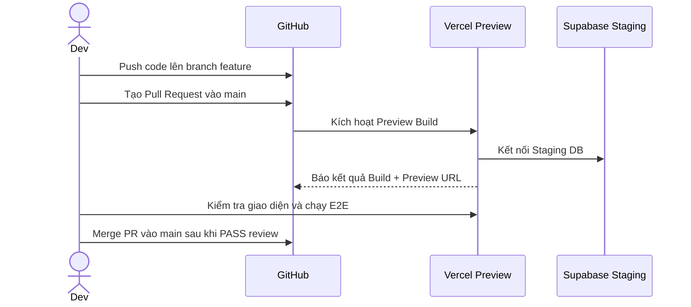
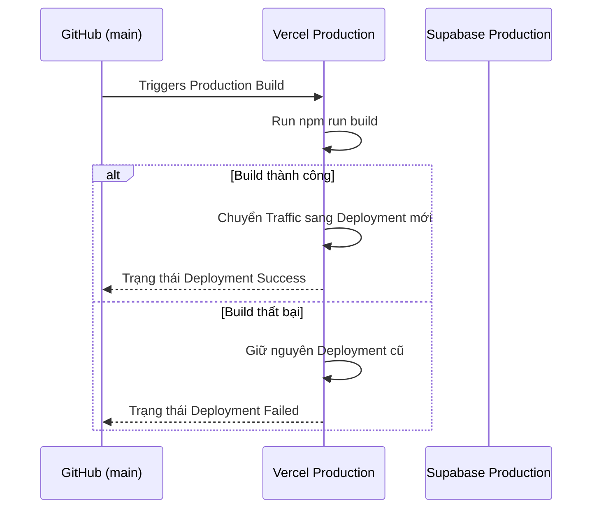

# Deployment

## Tavily web-ingestion release gate (feature 002)

Feature 002 changes only server-side web acquisition and adds no migration. It must not be
deployed until the release operator has checked the following current-state prerequisites:

| Precondition | Classification | Evidence/action |
|---|---|---|
| Migration `030_topic_course_multi_source` | READY | Read-only shared-project inspection on 2026-08-14 found migration version `20260813155929` and the required metadata/bridge tables. Recheck the target project before release. |
| Private `lesson-sources` bucket and policies | READY | Read-only inspection found the private bucket and four matching object policies. Recheck the target environment. |
| `TAVILY_API_KEY` in Vercel Production | REQUIRED BEFORE DEPLOY | Configure one server-only secret used by both Tavily Search and Basic Extract. No `NEXT_PUBLIC_TAVILY_API_KEY` is permitted. |
| Redeploy after Tavily secret configuration | REQUIRED BEFORE DEPLOY | Vercel environment-variable changes affect new deployments; redeploy only under separate release authorization. |
| Tavily-specific database/schema change | NOT REQUIRED | Feature 002 adds zero migrations, tables, columns, enums, or provider-result persistence. |
| Feature flag, Crawl, Research API, or Advanced Extract | NOT REQUIRED | The production policy is one Basic Markdown Extract call per explicitly confirmed URL. |

`TAVILY_API_KEY` is optional for ordinary build and startup, but both topic Research and new
manual/discovered URL acquisition require it at runtime. Missing/invalid/unavailable Tavily must
return a recoverable provider-neutral error. PDF/file ingestion and generation, regeneration,
Continue, review, and publication from already stored evidence remain available. There is no
automatic direct-fetch/Readability fallback.

### Feature 002 non-destructive rollback

Stop new web acquisition by removing/withholding the server-only Tavily credential or deploying a
narrow route-disable patch that returns the existing recoverable unavailable envelope. Continue
serving existing `source_documents`, immutable snapshots, chunks, Course-import jobs/bridges,
outline and Lesson revisions, citations, published Course content, and PDF/file workflows. Do not
delete or convert evidence, reverse migration 030, or reactivate direct fetch automatically.
Rolling application code back below feature 002 would reintroduce the known production-incompatible
direct-fetch acquisition defect, so prefer route disablement or a forward fix.

## Topic Course rollout and rollback gate

Phase 5 verifies readiness but does not authorize deployment. Before eventual enablement:

1. Rehearse migrations 001–030 against production-like data; record backfill/protected-content
   invariants, RLS, grants, RPC ACLs/search paths, and generated-type parity.
2. Deploy the additive database compatibility layer before a bridge-aware application.
3. Enable in order: multi-source generation, manual URL/file ingestion, then topic research.
   Provider terms/quota and snapshot retention/site-access policy need separate approval.
4. Monitor metadata-only research/fetch/source/ref/stale/publication signals and rerun legacy,
   learner/progress, Exercise, and accessibility gates.

Rollback keeps migration 030, snapshots, metadata/bridge rows, and historical revisions. Disable
research first, then URL ingestion, while retaining legacy PDF. Before rolling below bridge-aware
reads, stop multi-source writes and deploy a compatible intermediate release. Never delete
evidence/history or reverse the backfill.

## 1. Mục tiêu

Tài liệu này quy định quy trình đóng gói, kiểm tra và triển khai ứng dụng.

Mục tiêu:

- Triển khai ứng dụng Next.js trên Vercel.
- Quản lý môi trường Supabase đúng cách.
- Đảm bảo code trước khi deploy đã qua kiểm thử.
- Có quy trình rollback khi gặp sự cố.
- Giữ thông tin bí mật an toàn.

Môi trường áp dụng:

- Local.
- Preview / Staging.
- Production.

---

## 2. Các môi trường

## 2.1 Local

Môi trường phát triển trên máy lập trình viên.

Thành phần:

- Next.js dev server (`npm run dev`).
- Supabase local (`npx supabase start`) hoặc Supabase development project.
- Biến môi trường trong `.env.local`.

Mục đích:

- Viết code.
- Chạy unit test.
- Kiểm tra tính năng mới.
- Chạy migration mới.

---

## 2.2 Preview / Staging

Môi trường kiểm tra tự động tạo ra bởi Vercel khi có Pull Request.

Thành phần:

- Next.js Preview deployment.
- Supabase Staging/Development project.
- Biến môi trường cấu hình trong Vercel Preview settings.

Mục đích:

- Review giao diện.
- Chạy integration test.
- Chạy Playwright E2E test.
- Kiểm tra tính tương thích trước khi merge vào `main`.

Không dùng Supabase Production cho môi trường Preview.

---

## 2.3 Production

Môi trường chính thức cho người dùng.

Thành phần:

- Next.js Production deployment trên Vercel.
- Supabase Production project.
- Biến môi trường cấu hình trong Vercel Production settings.
- Domain chính thức có HTTPS.

Mục đích:

- Phục vụ người dùng thật.

Chỉ deploy Production từ branch `main`.

---

## 3. Biến môi trường

Danh sách biến môi trường bắt buộc:

| Biến môi trường | Loại | Mô tả | Môi trường |
|---|---|---|---|
| `NEXT_PUBLIC_SUPABASE_URL` | Public | URL Supabase đúng môi trường | Local, Preview, Production |
| `NEXT_PUBLIC_SUPABASE_ANON_KEY` | Public | Anon key; quyền thực tế vẫn bị giới hạn bởi RLS | Local, Preview, Production |
| `NEXT_PUBLIC_SITE_URL` | Public | Origin tuyệt đối, không có path; dùng cho auth redirect allowlist | Local, Preview, Production |
| `SUPABASE_SERVICE_ROLE_KEY` | Secret | Service-role key, chỉ được đọc trong server runtime | Local, Preview, Production |
| `AI_API_KEY` | Secret | API key truy cập 9Router OpenAI-compatible | Local, Preview, Production khi bật AI |
| `AI_PROVIDER_URL` | Server config | Endpoint `/v1/chat/completions` của 9Router; phải là HTTPS và không dùng localhost trên Vercel | Local, Preview, Production khi bật document pipeline |
| `AI_PROVIDER_MODEL` | Server config | Route do 9Router hỗ trợ, ưu tiên dạng `provider/model` hoặc alias đã cấu hình | Local, Preview, Production khi bật document pipeline |
| `TAVILY_API_KEY` | Optional-at-build server secret | Dùng chung cho Tavily Search và Basic Markdown Extract; bắt buộc khi bật Research hoặc nhận URL web mới. Nếu thiếu, hai action này lỗi recoverable; file/PDF và stored evidence vẫn hoạt động | Local, Preview, Production khi bật web research/ingestion |

`NODE_ENV` và `CI` do runtime/CI thiết lập, không lưu thủ công trong Vercel. `PLAYWRIGHT_BROWSER_EXECUTABLE_PATH` chỉ là override local/CI tùy chọn và không phải runtime variable của ứng dụng.

Quy tắc bảo mật:

- Biến có tiền tố `NEXT_PUBLIC_` sẽ xuất hiện trong client bundle.
- Không đưa `SUPABASE_SERVICE_ROLE_KEY`, `AI_API_KEY` hoặc `TAVILY_API_KEY` vào biến `NEXT_PUBLIC_`.
- `TAVILY_API_KEY` không phải điều kiện startup/build, nhưng phải có trước khi bật topic Research
  hoặc ingestion URL web mới. Không tồn tại biến `NEXT_PUBLIC_TAVILY_API_KEY`.
- File `.env.local` phải nằm trong `.gitignore`.
- Repository phải có `.env.example` chứa danh sách tên biến mẫu không chứa giá trị thật.
- Preview/E2E không được dùng URL, anon key hoặc service-role key của Production.
- Sau khi đổi secret phải redeploy môi trường tương ứng; không ghi giá trị secret vào log hay report.

---

## 4. Kiểm tra trước khi deploy

Trước khi merge code vào branch `main` hoặc kích hoạt Production build, các lệnh sau phải chạy thành công:

```bash
npm run lint
npm run typecheck
npm run test
npm run test:e2e
npm run build
git diff --check
```

Quy định:

- Không deploy nếu build có lỗi TypeScript.
- Không deploy nếu linter báo lỗi chưa sửa.
- Không deploy nếu có unit test hoặc integration test thất bại.
- Không deploy nếu deterministic E2E thất bại.
- Không deploy nếu trong code có chứa API key hardcoded.
- CI chạy E2E trong job Chromium riêng sau quality gates. Suite dùng local fixture server và dummy credentials, nên không cần Supabase/AI bên ngoài.

---

## 5. Quy trình triển khai

## 5.1 Quy trình phát triển tính năng



---

## 5.2 Quy trình deploy Production



---

## 6. Quy trình triển khai Database (Migrations)

Mọi thay đổi schema phải đi qua migration đã review. Thứ tự source-of-truth hiện tại là
`001_create_enums.sql` đến `030_topic_course_multi_source.sql`; áp dụng đúng thứ tự số tăng dần,
không bỏ qua hoặc đổi tên file đã phát hành. Feature 002 không thêm migration mới.

1. Tạo migration mới bằng `npx supabase migration new <name>`; không sửa file đã áp dụng ở môi trường dùng chung.
2. Review SQL, constraint, index, RLS, RPC privilege và generated types.
3. Chạy `npx supabase db reset` trên Supabase local hoặc database test rỗng. Không chạy reset trên Preview/Production.
4. Chạy test integration/RLS và full quality gates với dữ liệu fixture không phải Production.
5. Đối chiếu lịch sử đích bằng `npx supabase migration list` trước khi push.
6. Áp migration vào Staging/Preview bằng `npx supabase db push`, chạy smoke, rồi mới xin phê duyệt riêng cho Production.
7. Sau khi Production được phê duyệt, backup/point-in-time recovery phải sẵn sàng, áp migration một lần và ghi lại operator, thời điểm, commit SHA cùng kết quả.

Quy tắc an toàn:

- Không sửa trực tiếp cấu trúc bảng trên Supabase Dashboard của Production.
- Kiểm tra tính tương thích ngược (backwards compatibility) trước khi xóa hoặc đổi tên cột.
- Nếu migration có rủi ro làm gián đoạn ứng dụng, phải thực hiện theo 2 bước: thêm cột mới -> cập nhật app -> xóa cột cũ sau.
- TASK-040 không áp migration lên database bên ngoài; các lệnh push ở trên chỉ thuộc task deploy được ủy quyền riêng.

---

## 7. Cấu hình Vercel

Cấu hình dự án trên Vercel Dashboard:

- Framework Preset: `Next.js`
- Build Command: `npm run build`
- Output Directory: `.next`
- Install Command: `npm ci`
- Node.js Version: `22.x`, khớp `package.json`.

Quy định Branch protection trên GitHub:

- Branch `main` cần được bảo vệ.
- Yêu cầu Pull Request trước khi merge.
- Yêu cầu cả job quality gates và deterministic Chromium E2E thành công trước khi merge.

---

## 8. Quy trình Rollback

Nếu phiên bản Production gặp lỗi sau khi deploy:

## 8.1 Rollback ứng dụng trên Vercel

1. Dừng promote mới và ghi nhận deployment/commit gây lỗi.
2. Trong **Deployments**, chọn deployment gần nhất đã vượt smoke test.
3. Chọn **Promote to Production**, rồi chạy lại health và critical smoke bên dưới.
4. Không khẳng định RTO cố định; ghi thời điểm bắt đầu/kết thúc và kiểm tra traffic thực tế.

---

## 8.2 Rollback Database (nếu có)

Không dùng `db reset`, xóa migration history hoặc rollback SQL ad-hoc trên Production.

1. Xác định migration và tính tương thích của app version cũ với schema mới.
2. Nếu schema mới tương thích ngược, rollback app trước và giữ schema.
3. Nếu cần sửa schema/data, tạo forward-fix migration được review và kiểm thử trên bản sao/fixture Staging.
4. Với mất mát dữ liệu, dừng write path liên quan và dùng backup/PITR theo runbook của Supabase; không thử nghiệm bằng Production data.
5. Áp forward-fix chỉ trong task có ủy quyền Production riêng, sau đó chạy smoke và đối chiếu audit log.

---

## 9. Giám sát sau triển khai (Post-deployment Verification)

Chạy bằng tài khoản smoke riêng của môi trường; không dùng dữ liệu hay credential người dùng Production.

1. `GET /` và `GET /courses`: HTTP thành công, không có error overlay.
2. `GET /api/system/health`: response theo contract, database `connected`, không lộ URL/secret/error nội bộ.
3. Đăng nhập learner smoke; mở `/dashboard`, course detail, roadmap và một lesson được cấp quyền.
4. Nộp một exercise fixture có thể xóa/đối soát và xác minh progress; không sửa course thật.
5. Với moderator smoke, mở `/moderation`, kiểm tra queue/filter nhưng không publish nội dung Production.
6. Với admin smoke, mở `/admin/system` và `/admin/users`; không thay role/status.
7. Nếu AI được bật, gọi prompt smoke không chứa dữ liệu cá nhân và xác minh lỗi provider được xử lý an toàn.
8. Kiểm tra log/error rate và latency bất thường; rollback nếu có lỗi 5xx lặp lại, health degraded hoặc critical flow hỏng.

---

## 10. Danh sách kiểm tra triển khai (Deployment Checklist)

Trước khi công bố phiên bản mới, kiểm tra các mục sau:

- [ ] Release commit đã được review, merge vào `main` và có thể truy vết tới reports/task packet.
- [ ] `lint`, `typecheck`, `test`, deterministic `test:e2e`, `build` và `git diff --check` đều pass trên commit phát hành.
- [ ] Bundle budgets trong report performance đạt; exception (nếu có) được ghi rõ.
- [ ] Secret scan/staged diff không chứa credential; `.env.local` không được track.
- [ ] Public/secret boundary của toàn bộ biến ở mục 3 đã được đối chiếu riêng cho Preview và Production.
- [ ] Preview dùng Supabase non-Production và đã vượt smoke test.
- [ ] Migration list ở đích khớp repository; backup/PITR và forward-fix plan sẵn sàng trước mọi migration Production.
- [ ] Migration Production (nếu có) chỉ được áp sau phê duyệt riêng và đã ghi operator/time/commit SHA.
- [ ] Deployment ổn định trước đã được xác định để rollback; app cũ tương thích với schema mới.
- [ ] Post-deploy smoke ở mục 9 pass bằng tài khoản/fixture smoke, không dùng dữ liệu người dùng Production.
- [ ] Health, log, error rate và critical-flow monitoring không có dấu hiệu suy giảm.
