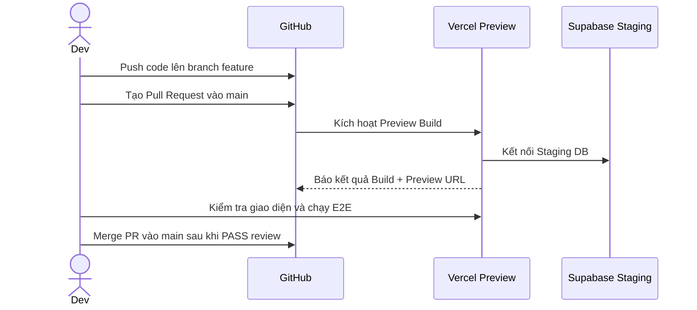
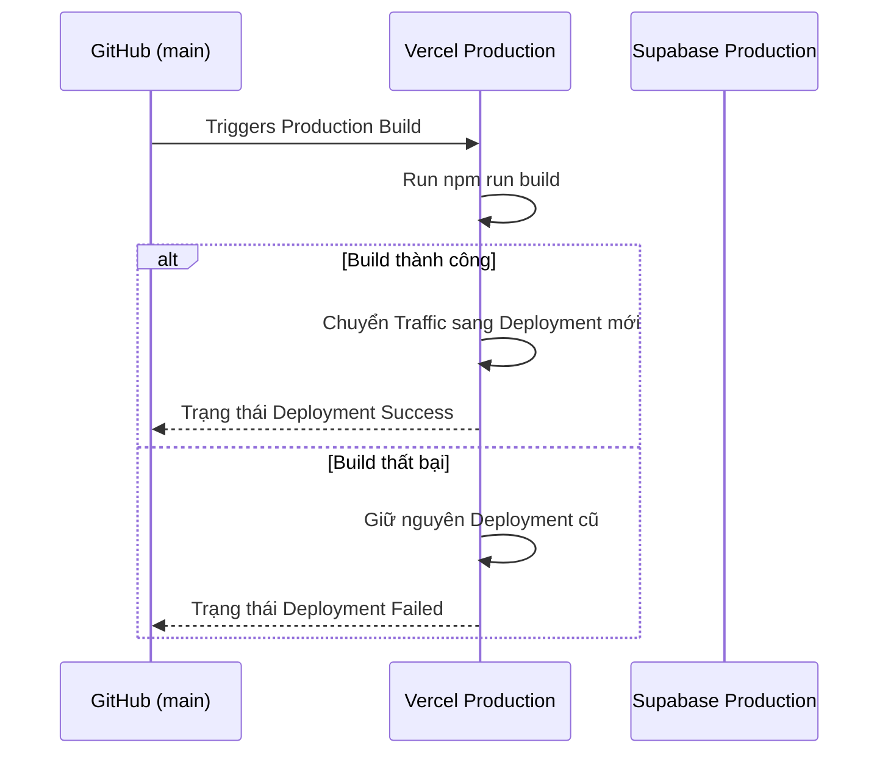

# Deployment

## 1. Mục tiêu

Tài liệu này quy định quy trình đóng gói, kiểm tra và triển khai ứng dụng.

Mục tiêu:

- Triển khai ứng dụng Next.js trên Vercel.
- Quản lý môi trường Supabase đúng cách.
- Đảm bảo code trước khi deploy đã qua kiểm thử.
- Có quy trình rollback khi gặp sự cố.
- Giữ thông tin bí mật an toàn.

Môi trường áp dụng:

- Local.
- Preview / Staging.
- Production.

---

## 2. Các môi trường

## 2.1 Local

Môi trường phát triển trên máy lập trình viên.

Thành phần:

- Next.js dev server (`npm run dev`).
- Supabase local (`npx supabase start`) hoặc Supabase development project.
- Biến môi trường trong `.env.local`.

Mục đích:

- Viết code.
- Chạy unit test.
- Kiểm tra tính năng mới.
- Chạy migration mới.

---

## 2.2 Preview / Staging

Môi trường kiểm tra tự động tạo ra bởi Vercel khi có Pull Request.

Thành phần:

- Next.js Preview deployment.
- Supabase Staging/Development project.
- Biến môi trường cấu hình trong Vercel Preview settings.

Mục đích:

- Review giao diện.
- Chạy integration test.
- Chạy Playwright E2E test.
- Kiểm tra tính tương thích trước khi merge vào `main`.

Không dùng Supabase Production cho môi trường Preview.

---

## 2.3 Production

Môi trường chính thức cho người dùng.

Thành phần:

- Next.js Production deployment trên Vercel.
- Supabase Production project.
- Biến môi trường cấu hình trong Vercel Production settings.
- Domain chính thức có HTTPS.

Mục đích:

- Phục vụ người dùng thật.

Chỉ deploy Production từ branch `main`.

---

## 3. Biến môi trường

Danh sách biến môi trường bắt buộc:

| Biến môi trường | Loại | Mô tả | Môi trường |
|---|---|---|---|
| `NEXT_PUBLIC_SUPABASE_URL` | Public | URL dự án Supabase | Tất cả |
| `NEXT_PUBLIC_SUPABASE_ANON_KEY` | Public | Anon key cho client | Tất cả |
| `SUPABASE_SERVICE_ROLE_KEY` | Secret | Service role key cho server | Tất cả |
| `AI_API_KEY` | Secret | API key của nhà cung cấp LLM | Server |
| `AI_PROVIDER` | Config | Nhà cung cấp AI (vd: `gemini`) | Server |
| `NODE_ENV` | System | Trạng thái môi trường (`development`/`production`) | Tất cả |

Quy tắc bảo mật:

- Biến có tiền tố `NEXT_PUBLIC_` sẽ xuất hiện trong client bundle.
- Không đưa `SUPABASE_SERVICE_ROLE_KEY` hoặc `AI_API_KEY` vào biến `NEXT_PUBLIC_`.
- File `.env.local` phải nằm trong `.gitignore`.
- Repository phải có `.env.example` chứa danh sách tên biến mẫu không chứa giá trị thật.

---

## 4. Kiểm tra trước khi deploy

Trước khi merge code vào branch `main` hoặc kích hoạt Production build, các lệnh sau phải chạy thành công:

```bash
npm run lint
npm run typecheck
npm run test
npm run build
```

Nếu dự án có E2E test bắt buộc:

```bash
npm run test:e2e
```

Quy định:

- Không deploy nếu build có lỗi TypeScript.
- Không deploy nếu linter báo lỗi chưa sửa.
- Không deploy nếu có unit test hoặc integration test thất bại.
- Không deploy nếu trong code có chứa API key hardcoded.

---

## 5. Quy trình triển khai

## 5.1 Quy trình phát triển tính năng



---

## 5.2 Quy trình deploy Production



---

## 6. Quy trình triển khai Database (Migrations)

Mọi thay đổi database schema phải được thực hiện thông qua SQL Migration.

Bước 1: Tạo migration file tại local

```bash
npx supabase migration new name_of_migration
```

Bước 2: Viết câu lệnh SQL trong file migration mới tạo.

Bước 3: Kiểm tra migration tại local

```bash
npx supabase db reset
```

Bước 4: Commit file migration vào Git.

Bước 5: Áp dụng migration cho Supabase Production

Thực hiện qua Supabase CLI hoặc GitHub Actions:

```bash
npx supabase db push
```

Quy tắc an toàn:

- Không sửa trực tiếp cấu trúc bảng trên Supabase Dashboard của Production.
- Kiểm tra tính tương thích ngược (backwards compatibility) trước khi xóa hoặc đổi tên cột.
- Nếu migration có rủi ro làm gián đoạn ứng dụng, phải thực hiện theo 2 bước: thêm cột mới -> cập nhật app -> xóa cột cũ sau.

---

## 7. Cấu hình Vercel

Cấu hình dự án trên Vercel Dashboard:

- Framework Preset: `Next.js`
- Build Command: `npm run build`
- Output Directory: `.next`
- Install Command: `npm ci`
- Node.js Version: `20.x` hoặc phiên bản LTS mới nhất được hỗ trợ.

Quy định Branch protection trên GitHub:

- Branch `main` cần được bảo vệ.
- Yêu cầu Pull Request trước khi merge.
- Yêu cầu các kiểm tra CI (Build, Lint, Test) thành công trước khi merge.

---

## 8. Quy trình Rollback

Nếu phiên bản Production gặp lỗi sau khi deploy:

## 8.1 Rollback ứng dụng trên Vercel

1. Truy cập Vercel Dashboard -> dự án `learning-app`.
2. Vào mục **Deployments**.
3. Tìm phiên bản deployment gần nhất hoạt động ổn định.
4. Chọn **Promote to Production**.
5. Vercel sẽ chuyển ngay lập tức traffic về phiên bản cũ.

Thời gian rollback ứng dụng: < 1 phút.

---

## 8.2 Rollback Database (nếu có)

Nếu deployment mới đi kèm migration làm hỏng dữ liệu:

1. Xác định file migration gây lỗi.
2. Viết migration khắc phục (revert migration).
3. Chạy `npx supabase db push` để áp dụng migration khắc phục.
4. Không tự ý chỉnh sửa thủ công dữ liệu trên Production Dashboard nếu không có kịch bản đã review.

---

## 9. Giám sát sau triển khai (Post-deployment Verification)

Sau khi deploy thành công lên Production, thực hiện kiểm tra nhanh (Smoke Test):

1. Truy cập trang chủ.
2. Thử đăng nhập bằng tài khoản test.
3. Mở một bài học và kiểm tra hiển thị.
4. Nộp thử một bài tập static.
5. Thử gọi AI Mentor giải thích 1 câu để đảm bảo API key hoạt động.
6. Kiểm tra log trên Vercel để đảm bảo không xuất hiện lỗi 500 hàng loạt.

---

## 10. Danh sách kiểm tra triển khai (Deployment Checklist)

Trước khi công bố phiên bản mới, kiểm tra các mục sau:

- [ ] Tất cả code đã được merge vào `main`.
- [ ] Không có secret hardcode trong repository.
- [ ] File migration đã được commit và push.
- [ ] Đã chạy `npx supabase db push` lên Production DB (nếu có migration mới).
- [ ] Biến môi trường trên Vercel Production đã đầy đủ.
- [ ] `npm run build` chạy thành công không có lỗi TypeScript/ESLint.
- [ ] Smoke test trên Production URL thành công.
- [ ] Log hệ thống không có exception nghiêm trọng.
